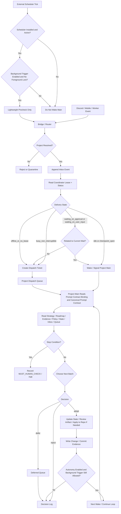

# Shared Working Memory Strategy v3

## Purpose

이 전략의 목표는 다음 네 가지를 동시에 만족하는 운영 모델을 확정하는 것이다.

- 모바일/외부 입력이 메인 조율자에게 실질적 영향을 주게 한다.
- 메인 조율자를 유일한 foreground executor로 유지한다.
- 백그라운드 워커와 외부 입력을 하나의 공용 작업기억으로 통합한다.
- 로컬 저장소를 더럽히지 않고, foreground 검수 없이 commit/push가 일어나지 않게 한다.
- 여러 workspace/project가 동시에 있어도 요청, 상태, 메인 권한이 섞이지 않게 한다.
- 명시적 opt-in 시, 사람이 자는 동안에도 메인이 전략서와 상태를 읽고 다음 batch를 이어갈 수 있게 한다.

이 문서는 `숨은 내부 메모리 공유`나 `메인 스레드 직접 주입`을 전제로 하지 않는다.
운영 기억은 외부화된 공용 작업기억으로 관리하고, 메인 조율자는 체크포인트에서만 이를 읽고 반영한다.

## Scope

이 전략은 다음 환경을 전제로 한다.

- Codex/ChatGPT 계열의 호출형 foreground 대화
- 백그라운드 워커 또는 외부 브리지 존재
- 로컬 저장소 위생이 중요한 pre-production 또는 direct-branch 운영
- 단일 저장소 안의 복수 프로젝트 또는 복수 workspace 동시 운영 가능성

이 전략은 다음 문제를 다룬다.

- 외부 입력을 메인 판단에 합류시키는 방법
- background/foreground lane 충돌 방지
- 재시작 후 현재 운영 상태 복원
- worker pulse 누락 및 중복 실행 방지
- dirty repo, mixed commit, stale current point 방지
- 여러 프로젝트 사이의 라우팅 오류와 메인 권한 혼선 방지

이 전략은 다음 문제를 해결하지 않는다.

- 메인 스레드에 대한 실시간 direct injection
- 메인이 turn 밖에서 스스로 무한 실행하는 구조
- foreground 검수 없이 로컬 repo를 무인 상태로 계속 수정/배포하는 구조

## Execution Control Documents

이 전략의 실행 통제 문서는 아래 두 개다.

- 수행 계획 원문: [EXECUTION_PLAN.md](./EXECUTION_PLAN.md)
- WBS 원문: [WBS.md](./WBS.md)

규칙:

- 전략은 불변식과 금지 패턴의 원문이다.
- 수행 계획은 전략을 실행 가능한 package로 분해한 일정/상태 문서다.
- WBS는 package를 leaf 작업으로 더 쪼갠 rollout 통제 문서다.
- 수행 계획과 WBS의 모든 항목은 반드시 `status`를 가져야 한다.
- 수행 계획과 WBS는 전략의 관련 section에 대한 명시적 레퍼런스를 가져야 한다.
- 전략과 계획이 충돌하면 전략 불변식이 우선이고, 계획과 WBS 사이의 실행 순서는 계획/WBS가 우선한다.

## Why This Strategy

현재 Codex 계열 구조에서는 다음 사실을 받아들여야 한다.

- 메인은 turn이 끝난 뒤 스스로 다시 시작하지 않는다.
- 외부 입력이 활성 turn 중간에 자연스럽게 섞이는 구조를 기대하기 어렵다.
- background worker 결과와 foreground 로컬 저장소 쓰기를 같은 권한으로 두면 충돌과 dirty repo가 생긴다.

따라서 가장 안정적인 모델은 아래다.

- 외부 입력 -> 먼저 project namespace로 라우팅된 뒤 해당 inbox에 기록
- worker 결과 -> inbox event + pulse snapshot + 필요 시 artifact로 기록
- 프로젝트별 메인 조율자 -> 자기 namespace에서만 체크포인트 읽고 adopt/defer/reject 판단
- 현재 목표/현재 본선/활성 오너/진척률 -> 해당 프로젝트 메인만 상태 파일에 반영
- repo 코드/문서/commit/push -> foreground 메인만 수행

이 전략은 `하나의 숨은 뇌`를 만들려는 것이 아니라, `하나의 외부화된 작업기억을 읽는 단일 foreground 뇌`를 만드는 전략이다.

## External Reality Check

2026년 3월 25일 기준 공식 문서에서 확인되는 사실은 아래다.

- 2026년 2월 2일 OpenAI 릴리스 노트: Codex app은 multiple agents in parallel, long-horizon/background tasks, clean diffs from isolated worktrees, skills, automations를 제공한다.
- 2026년 3월 4일 기준 Codex app은 macOS뿐 아니라 Windows도 공식 지원 surface다.
- `Using Codex with your ChatGPT plan` 도움말: Codex app은 built-in worktree support, skills, automations, git functionality를 제공하고, cloud delegated tasks는 isolated sandbox에서 실행되며 review, merge, pull-down 가능한 결과를 만든다.
- `Tasks in ChatGPT` 도움말: ChatGPT tasks는 Web, iOS, Android, macOS에서 관리 가능하고, 사용자가 오프라인이어도 예약된 시점에 실행될 수 있다.
- 같은 `Using Codex with your ChatGPT plan` 도움말은 Slack을 Codex 요청 채널로 직접 언급한다. 반면 Discord는 OpenAI 공식 Codex surface로 같은 수준에서 문서화된 채널로 확인되지 않았다.

하지만 위 capability가 곧바로 아래를 뜻하지는 않는다.

- 현재 로컬 direct-branch 저장소에 대한 무인 foreground write authority
- 메인 foreground turn에 대한 실시간 direct injection
- foreground 검수 없는 자동 commit/push

이 전략은 공식 capability를 과장하지 않는다.

- background task: 가능
- scheduled tasks / proactive tasks: 가능
- isolated cloud sandbox: 가능
- isolated worktree 기반 clean diff handoff: 가능
- 현재 로컬 direct-branch 저장소에 대한 무인 commit/push: 별도 안전장치 없이는 금지

즉 이 전략은 공식 capability를 활용하되, 로컬 저장소 위생과 foreground 책임 분리를 더 강하게 둔다.

추가 해석:

- Slack은 2026년 3월 25일 기준 OpenAI가 Codex 요청 채널로 직접 언급한 공식 연결면이다.
- Discord는 같은 기준에서 공식 Codex surface라기보다 **커스텀 operator ingress**로 취급해야 한다.
- 따라서 Discord를 쓰더라도 Codex 내부 foreground turn에 직접 주입하는 구조가 아니라, shared memory로 정규화하는 외부 브리지 구조로 설계해야 한다.

## Ingress Architecture Decision

이 전략의 **정식 Discord ingress 구조**는 아래 하나로 고정한다.

- **Canonical production ingress = Discord Gateway adapter**

이 결정은 취향 문제가 아니라, 현재 요구사항과 공식 제약을 동시에 만족하는 가장 깔끔한 경계이기 때문이다.

### 왜 Gateway adapter인가

- Discord 공식 문서 기준 interaction 수신 경로는 둘 중 하나다.
  - Gateway connection
  - HTTP outgoing webhooks
- HTTP outgoing webhooks를 쓰려면 Discord가 도달 가능한 **공개 HTTPS endpoint**가 필요하다.
- 반면 Gateway 방식은 로컬 프로세스가 Discord로 **아웃바운드 연결**을 만들기 때문에, 로컬 bridge를 인터넷에 직접 노출할 필요가 없다.
- Remodex의 핵심 목표는 `로컬 Codex app-server를 안전하게 계속 쓰면서`, `Discord를 operator surface로 붙이는 것`이다.
- 이 목표에는 공개 inbound webhook보다 **로컬 outbound Gateway adapter**가 더 잘 맞는다.

### canonical topology

```text
Discord user
-> Discord Gateway
-> local Discord Gateway adapter
-> internal bridge runtime
-> shared memory
-> foreground main / scheduler
-> local Codex app-server
-> Codex app thread
```

핵심 원칙:

- Discord는 로컬 `Codex app-server`를 직접 치지 않는다.
- Discord는 로컬 `bridge daemon`의 loopback HTTP를 직접 치지 않는다.
- Discord와 로컬 노드 사이의 네트워크 경계는 **Gateway adapter**가 담당한다.
- Remodex 내부 truth는 여전히 shared memory와 app-server/thread state다.

### internal bridge HTTP의 지위

현재 저장소의 `bridge daemon` HTTP 서버는 아래 용도로만 본다.

- loopback health
- local probe
- internal admin route
- optional local relay intake

즉 현재의 `/discord/interactions` 경로는 **production Discord edge가 아니다**.

- `127.0.0.1`에 바인딩된 internal endpoint일 뿐이다.
- 실운영 Discord ingress 완성 근거로 계산하면 안 된다.
- Discord-style signed payload probe를 production Discord ingress 검증으로 간주하면 안 된다.

### webhook relay는 언제 쓰나

Webhook relay는 **차선책**이다.

적합한 경우:

- Gateway adapter를 당장 만들 수 없고
- 공개 HTTPS ingress를 단기적으로 붙여야 하며
- 운영자가 별도 relay/tunnel을 감당할 수 있을 때

하지만 webhook relay를 canonical path로 두면 안 된다.

이유:

- public HTTPS endpoint가 필요하다
- Discord `PING/PONG`, 3초 ACK, follow-up/edit original response 계약을 맞춰야 한다
- raw localhost bridge를 공개 edge로 쓰면 안 되고, 별도 Discord facade가 필요하다
- tunnel / reverse proxy / cert / public exposure 관리가 추가된다

### Tailscale의 역할

Tailscale은 이 전략에서 **사람용 접근면**이지, Discord ingress 수단이 아니다.

- `Tailscale Serve`
  - tailnet 내부 사람/기기에서 dashboard나 내부 UI를 여는 용도
- `Tailscale Funnel`
  - public internet에 노출해야 하는 webhook relay의 보조 수단일 뿐
  - canonical Discord ingress가 아니다

금지:

- Discord가 tailnet 내부 IP:port를 직접 볼 수 있다고 가정
- `tailscale serve`만으로 Discord webhook ingress가 된다고 가정
- raw bridge daemon을 Funnel 뒤에 그대로 노출

### production ingress score gate

아래가 닫히기 전에는 이 전략을 `98+` 완성 전략으로 평가하면 안 된다.

- Gateway adapter 책임 경계 정의
- Discord command/message surface와 shared memory contract 연결
- Discord 응답 방식
  - immediate ack
  - deferred response
  - follow-up / status push
- operator identity / ACL / replay 방어
- foreground/background/main/human-gate와의 충돌 없는 arbitration

즉, **production Discord ingress 결정이 비어 있던 이전 문서는 고득점 완성 전략이 아니었다.**

## Core Principles

### 1. Single Active Brain

- 최종 판단과 foreground 실행은 **프로젝트별 메인 조율자 1명**만 담당한다.
- background worker, mobile bridge, observer는 현재 계획/우선순위/활성 오너를 확정하지 않는다.

### 2. Shared External Memory

- 운영 기억은 스레드 내부가 아니라 파일 기반 외부 공용 작업기억에 저장한다.
- 공용 작업기억은 전역 1개 flat space가 아니라 `workspace_key/project_key`별 namespace로 분리한다.
- 메인은 turn 시작/종료 등의 안전한 체크포인트에서만 읽는다.

### 3. Intent, Not Direct Injection

- 외부 입력은 메인 스레드에 직접 주입하지 않는다.
- intent/event로 정규화해 inbox에 적재한다.

### 4. Workers Record, Main Decides

- worker는 pulse, batch event, artifact를 기록할 수 있다.
- 메인은 inbox, latest pulse, artifact를 읽고 다음 validated batch를 다시 배정한다.

### 5. Foreground-Only Repository Mutation

- 코드 수정, 문서 수정, stage 판정, git add, commit, push는 foreground 메인만 수행한다.
- background 주체는 repo authoritative files를 수정하지 않는다.

### 6. Repository Hygiene First

- 공용 작업기억은 repo 밖에 둔다.
- background 기록 때문에 로컬 저장소가 dirty해지는 구조는 실패로 본다.

### 7. No Global Main

- 전역 메인은 두지 않는다.
- `메인`은 thread id 하드코딩이 아니라 `(workspace_key, project_key)`별 `coordinator lease`로 식별한다.
- 여러 프로젝트가 있으면 메인도 프로젝트 수만큼 존재할 수 있지만, **한 프로젝트 안의 활성 메인 lease는 항상 하나**여야 한다.

### 8. Strategy-Bound Continuation

- 자율 연속 작업이 필요하면, 메인은 현재 전략서와 stop condition을 읽고 다음 smallest batch를 스스로 선택할 수 있어야 한다.
- 이때 cron/automation은 **깨우는 역할**만 하고, 작업 내용 결정은 여전히 메인이 한다.
- 이 모드는 명시적 opt-in 없이는 기본 비활성이다.

## Architecture

```text
Discord user
-> Discord Gateway
-> local Discord Gateway adapter
-> router / resolver
-> (workspace_key, project_key) namespace

mobile browser / operator UI
-> Tailscale Serve or local-only dashboard access
-> read-only dashboard / admin surface

local/isolate workers
-> project-local inbox/*.md                 # append-only batch events
-> project-local pulses/*.md                # latest per-owner snapshot only
-> project-local artifacts/*                # patch/diff/log bundles, never authoritative repo state

cloud delegated workers
-> Codex/native result surface (isolated sandbox result)
-> local result ingestor / courier
-> project-local inbox/*.md
-> project-local artifacts/*
-> project-local pulses/*.md

project foreground main coordinator
-> confirms project coordinator lease
-> reads project unread inbox + latest pulses at safe checkpoints
-> reviews project artifacts
-> writes project state/*
-> writes project decisions.log
-> updates project repo/docs/code only after review
-> assigns next validated batch for that project
```

## Routing And Namespace Rule

이 전략에는 전역 메인은 없고, 전역 **입구와 라우터**만 있다.

- 모든 외부 입력은 먼저 `workspace_key`와 `project_key`를 결정해야 한다.
- 라우팅이 끝나기 전에는 어떤 메인도 그 입력을 읽지 않는다.
- 라우팅 실패 입력은 project inbox로 들어가면 안 된다.
- project를 모르는 입력은 `reject` 또는 별도 `quarantine`에만 둘 수 있다.
- 브리지/cron은 라우터를 건너뛰고 임의 project inbox에 쓰면 안 된다.
- registry에 없는 새 project는 자동 생성하지 않는다. 명시적 bootstrap 또는 manual triage가 필요하다.

프로젝트 식별 우선순위:

1. 명시적 command argument의 `workspace_key/project_key`
2. Discord channel/thread와 project의 사전 매핑
3. bridge 설정의 명시적 workspace/project route
4. 그래도 못 찾으면 reject 또는 quarantine

금지:

- 자유문장만 보고 브리지가 project를 추측
- “지난번이랑 비슷하니 아마 alpha” 같은 휴리스틱 라우팅
- 하나의 inbox를 여러 프로젝트가 공유

## Coordinator Lease Rule

메인은 고정 thread id가 아니라 **project-scoped coordinator lease**로 식별한다.

- lease 단위는 `(workspace_key, project_key)`다.
- 같은 project에 동시에 유효한 lease는 하나만 허용한다.
- lease는 foreground main의 명시적 claim/handoff/recovery로만 바뀐다.
- background worker, bridge, cron은 스스로 lease를 획득하면 안 된다.
- lease는 thread ref, claimed_at, epoch, handoff reason을 가져야 한다.

핵심 의미:

- `메인 = 영원한 스레드 1개`가 아니다.
- `메인 = 지금 이 프로젝트의 coordinator lease를 가진 foreground 주체`다.

## Multi-Project Namespace Rule

같은 repo 안에서도 project가 다르면 상태와 판단권은 분리한다.

- `workspace_key`는 어느 저장소/작업공간인지 식별한다.
- `project_key`는 그 작업공간 안의 어느 제품 흐름/목표인지 식별한다.
- `progress axes`, `pending_artifacts`, `deferred_queue`, `operator_acl`, `publication_mode`는 전부 project별이다.
- 하나의 project에서 나온 inbox/pulse/artifact를 다른 project 메인이 읽거나 채택하면 실패다.

옵션:

- 여러 project를 사람이 한 화면에서 보고 싶다면 별도 portfolio dashboard를 둘 수 있다.
- 하지만 portfolio view는 라우팅/관찰용일 뿐, project lease를 대체하지 못한다.

## Observability Dashboard Rule

운영 이력을 사람이 빠르게 읽어야 하는 시점부터는 별도 대시보드를 둘 수 있다.

원칙:

- 대시보드는 `관측면`이지 `제어면`이 아니다.
- 대시보드는 `state/*`, `runtime/*`, `processed/*`, `router/outbox/*`, `router/pending_approvals.json`을 읽기만 해야 한다.
- 대시보드는 project별 현재 상태와 portfolio 수준의 운영 이력을 한 화면에서 보여줄 수 있다.
- 대시보드는 coordinator lease, approval closure, worker 지시, background trigger 변경을 직접 수행하면 안 된다.
- 대시보드는 별도 truth나 독자적인 상태 DB를 만들면 안 된다.

필수 화면:

- portfolio overview
- project detail
- timeline/history
- human gate view
- incident quick view

자세한 MVP 범위는 [DASHBOARD_MVP.md](./DASHBOARD_MVP.md)를 따른다.

## Mandatory Placement Rule

공용 작업기억은 저장소 안이 아니라 **저장소 밖**에 둔다.

권장 예시:

```text
/Users/<user>/.codex-state/
  registry/
  <workspace-key>/
    routing/
    projects/
      <project-key>/
        inbox/
        pulses/
        state/
        contracts/
        archive/
        decisions.log
```

조건부 허용 예시:

```text
/tmp/<workspace-key>-<project-key>-coord/
```

단, `/tmp`는 아래 조건을 모두 만족할 때만 허용한다.

- 명시적 `ephemeral mode`로 운영
- 재부팅/정리로 사라져도 복구 요구가 없는 세션
- `Restart Recovery` 보장을 요구하지 않는 일회성 세션

기본 운영 경로로는 권장하지 않는다.

금지 예시:

```text
<repo>/coord/
<repo>/.coord/
<repo>/tmp/coord/
```

이 금지 규칙의 이유는 단순하다.

- inbox/pulse/state 파일이 repo 안에 있으면 저장소가 상시 dirty해진다.
- background 기록 자체가 mixed commit 위험이 된다.
- 사용자가 foreground에서 보는 git status truth가 흐려진다.

## Directory Layout

```text
external-shared-memory/
  registry/
    workspaces.md
    routing_rules.md
    quarantine/
  workspace-foo/
    routing/
      channel-map.md
      thread-map.md
    projects/
      alpha/
        state/
          project_identity.md
          coordinator_lease.md
          coordinator_status.md
          strategy_binding.md
          prompt_contract_binding.md
          roadmap_status.md
          autonomy_policy.md
          background_trigger_toggle.md
          stop_conditions.md
          current_goal.md
          current_plan.md
          current_focus.md
          active_owner.md
          progress_axes.md
          deferred_queue.md
          pending_artifacts.md
          processed_correlation_index.md
          operator_acl.md
          publication_mode.md
          unread_cursor.json
        inbox/
          2026-03-25T10-31-22_mobile_priority_change_001.md
          2026-03-25T10-32-10_worker_backend_pulse_014.md
        dispatch_queue/
          2026-03-25T10-31-22_mobile_priority_change_001.ticket.md
        human_gate_candidates/
          2026-03-25T10-31-22_discord_approve_001.json
        processed/
          2026-03-25T10-31-22_mobile_priority_change_001.json
        pulses/
          pipeline.md
          frontend.md
          tester.md
          bridge.md
        artifacts/
          backend/
            2026-03-25T10-34-10_patch_bundle_001/
              summary.md
              changes.patch
              validation.txt
              metadata.json
        runtime/
          scheduler_runtime.md
          tick_journal/
            2026-03-25T02-05-00_tick.md
        evidence/
          commit_ledger.md
          applied_artifacts.md
          change_sets/
            2026-03-25T11-10-00_apply_batch_003/
              summary.md
              changed_files.txt
              validation.txt
              commit_refs.txt
        contracts/
          routing-schema.md
          coordinator-lease-schema.md
          coordinator-status-schema.md
          dispatch-ticket-schema.md
          autonomy-policy-schema.md
          background-trigger-toggle-schema.md
          scheduler-runtime-schema.md
          prompt-contract-binding-schema.md
          trigger-event-schema.md
          roadmap-status-schema.md
          execution-evidence-schema.md
          intent-schema.md
          pulse-schema.md
          decision-schema.md
          progress-schema.md
          artifact-schema.md
          operator-authz-schema.md
          processed-receipt-schema.md
        archive/
        decisions.log
      beta/
        ...
  workspace-bar/
    projects/
      gamma/
        ...
```

추가 규칙:

- 메인 스레드가 shared memory를 읽는 방식은 project별 `state/prompt_contract_binding.md`가 가리키는 **고정 프롬프트 계약 문서**로 맞춘다.
- 권장 canonical 문서 위치는 repo root의 `/Users/mymac/my dev/remodex/MAIN_COORDINATOR_PROMPT_CONTRACT.md`다.
- background cron/autonomy 개입 가능 여부는 project별 `state/background_trigger_toggle.md`가 단일 truth다.
- background 자동 루프가 실제로 존재하는지 여부는 project별 `runtime/scheduler_runtime.md`가 나타낸다.
- 즉, 토글이 켜져 있어도 외부 스케줄러가 실제로 설치/활성 상태가 아니면 자동 wake는 일어나지 않는다.

## Event vs Snapshot Rule

이 전략의 전달 계층은 두 종류로 분리한다.

### 1. Inbox = Immutable Event Log

- `inbox/*`는 append-only다.
- 메인이 채택 여부를 판단해야 하는 모든 항목은 반드시 `inbox/*`에 새 파일로 남긴다.
- worker batch 완료, 모바일 요청, bridge 정규화 결과, artifact 제출 모두 `inbox/*`에 기록한다.
- audit와 restart recovery의 기준은 `inbox/*`다.

### 2. Pulses = Latest Per-Owner Snapshot

- `pulses/*`는 owner별 최신 상태 요약본이다.
- 같은 owner가 다음 pulse를 보내면 이전 pulse snapshot은 덮어써도 된다.
- `pulses/*`만으로는 audit를 대체하지 못한다.
- 어떤 validated batch도 `pulses/*`에만 존재하면 안 된다.

즉, **메인이 판단해야 하는 사실은 항상 inbox에 append되고, pulses는 최신 상태 가독성을 위한 캐시일 뿐이다.**

추가 규칙:

- cloud worker 결과도 local result ingestor가 `inbox/*` event로 재기록하기 전까지는 운영 truth로 간주하지 않는다.
- 메인은 Codex cloud/native 결과 surface를 직접 truth source로 취급하지 않고, local shared memory에 ingest된 사실만 읽는다.

## Persistence vs Delivery Rule

이 전략에서는 `기록`과 `전달`을 같은 것으로 보지 않는다.

- `inbox/*`는 영구 기록이다.
- `dispatch_queue/*`는 아직 메인에게 안전하게 전달되지 않은 전달 대기열이다.
- `processed/*`는 이미 전달 또는 채택 판단이 끝난 event/queue 처리 영수증이다.
- `human_gate_candidates/*`는 approval 대기 중 operator 승인을 담는 append-only 후보함이다.
- 모든 외부 입력과 worker 결과는 **먼저 inbox에 기록**된 뒤에만 전달 판단 대상이 된다.
- bridge는 inbox를 건너뛰고 메인에게 직접 주입하면 안 된다.
- 즉시 전달이 허용되더라도, 그것은 `inbox 기록 후 즉시 wake/signal`이지 `기록 없는 direct injection`이 아니다.

핵심:

- inbox = 감사/복구용 truth
- dispatch_queue = busy 상태에서의 전달 보류 장치
- processed = 이미 소비된 correlation의 영수증
- human_gate_candidates = foreground human gate만 소비 가능한 승인 후보함
- main decision = 최종 채택/보류/기각

추가 규칙:

- foreground drain 또는 recovery replay가 성공하면, 시스템은 반드시 `processed/*`에 영수증을 남겨야 한다.
- 그 영수증은 최소한 `workspace_key`, `project_key`, `source_ref`, `correlation_key`, `processed_at`, `processed_by`, `disposition`를 가져야 한다.
- 원본 inbox를 즉시 제거하지 않더라도, 같은 project에서 같은 `correlation_key`가 `processed/*`에 존재하면 recovery/router/bridge는 중복 replay를 금지해야 한다.
- `dispatch_queue`만 close하고 `processed/*` 영수증을 남기지 않으면 restart recovery에서 duplicate replay가 발생할 수 있으므로 실패로 본다.
- delivery worker가 same-thread turn을 시작했다면 `runtime/inflight_delivery.json`을 turn id 발급 직후 즉시 남겨야 한다.
- recovery/router/scheduler는 새 turn을 열기 전에 `inflight_delivery`부터 검사해야 한다.
- `inflight_delivery`가 가리키는 turn이 이미 terminal status면 recovery는 새 turn을 열지 말고 `processed/*` 영수증을 기록한 뒤 inflight를 정리해야 한다.
- inflight recovery가 같은 `correlation_key`를 이미 `processed/*`로 승격했다면, 원래 async delivery worker는 새 `consumed` 영수증을 추가로 쓰지 말고 기존 영수증을 재사용해야 한다.
- background scheduler/launchd는 `human_gate_candidates/*`를 `processed/*`로 승격하거나 소비하면 안 된다.
- `human_gate_candidates/*`의 `processed/*` 승격은 foreground human gate closure에서만 가능하다.

## Atomic Write Rule

공용 작업기억은 file-based이므로, 기록 규약이 원자적이지 않으면 전략 전체가 흔들린다.

모든 writer는 아래 규칙을 따른다.

1. 최종 파일을 직접 열어 쓰지 않는다.
2. 같은 디렉터리 안의 temp file에 먼저 쓴다.
3. write 완료 후 flush/fsync를 수행한다.
4. 마지막에 atomic rename으로 최종 경로에 배치한다.
5. 동일 basename 재사용을 피하기 위해 timestamp + dedupe suffix를 붙인다.

추가 규칙:

- `inbox/*`는 overwrite 금지, append-only 신규 파일만 허용
- `pulses/*`는 owner별 latest snapshot이라 overwrite 가능하지만 temp-write 후 atomic rename만 허용
- partial write, truncated file, zero-byte file은 invalid event로 간주하고 메인이 reject한다
- writer는 `metadata.json` 또는 front matter에 `written_at`, `writer_id`, `atomic_write: true`를 남기는 것을 권장한다

## Cloud Result Ingestion Rule

`Mode C` 또는 cloud delegated task를 쓰는 경우, cloud sandbox는 local shared memory를 직접 authoritative하게 쓴다고 가정하지 않는다.

따라서 별도 운반 계층이 필요하다.

### Ingestion Principle

- cloud worker는 OpenAI/Codex가 제공하는 native result surface에 결과를 남긴다.
- local result ingestor 또는 foreground bridge가 그 결과를 수집한다.
- 수집된 결과는 local shared memory에 아래 순서로 반영된다.
  1. artifact bundle 저장
  2. inbox event append
  3. latest pulse snapshot 갱신

### Why This Matters

- cloud sandbox와 local host filesystem은 동일 권한 공간이 아니다.
- 결과가 local shared memory로 ingest되기 전에는 restart recovery, dedupe, decision logging의 대상이 될 수 없다.
- 따라서 cloud result를 직접 운영 truth로 읽는 설계는 금지한다.

## Artifact Handoff Rule

worker가 실제 구현 가치를 만들려면 `기록만`으로는 부족하다. 대신 authoritative repo write를 허용하지 않고, 아래 handoff 계층을 둔다.

### Allowed Worker Outputs

- `changes.patch`
- isolated worktree 또는 cloud sandbox에서 생성한 diff bundle
- 테스트 로그
- 스크린샷
- 검증 결과
- 설계 메모

이 산출물은 모두 `external-shared-memory/artifacts/*` 아래에 둔다.

### Forbidden Worker Outputs

- 메인 local repo tracked file 직접 수정
- 메인 local repo에서 git add/commit/push
- 메인 local repo의 current-point 문서 직접 수정

### Artifact Submission Contract

모든 artifact 제출은 아래를 가져야 한다.

- `workspace_key`
- `project_key`
- `namespace_ref`
- `artifact_type`
- `owner`
- `source_env`
- `base_ref`
- `base_commit_sha`
- `base_tree_fingerprint`
- `dirty_allowlist`
- `touched_paths`
- `new_paths`
- `summary`
- `validation`
- `artifact_path`
- `dedupe_key`

메인은 artifact를 검토한 뒤에만 adopt/reject를 결정한다.

추가 규칙:

- artifact는 정확한 project namespace에만 제출할 수 있다.
- `workspace_key/project_key/namespace_ref`가 빠진 artifact는 invalid다.
- 다른 project namespace에 있는 artifact를 현재 project 채택 대상으로 읽으면 안 된다.

### Artifact Fingerprint Semantics

`artifact-schema.md`는 아래 계산 규약을 그대로 고정해야 한다.

#### 1. `base_commit_sha`

- producer 환경이 artifact 생성을 시작할 때 바라보던 정확한 Git `HEAD` commit sha다.
- detached HEAD여도 허용하지만, 정확한 commit sha여야 한다.

#### 2. `base_tree_fingerprint`

- 목적: artifact가 어떤 tracked working tree 상태를 기준으로 만들어졌는지 deterministic하게 비교하기 위함이다.
- 계산 대상:
  - `base_commit_sha`
  - producer 환경에서 artifact 생성 직전의 tracked dirty set
- canonical manifest 형식:
  - 첫 줄: `HEAD\t<base_commit_sha>`
  - 이후 줄: tracked dirty 경로를 상대경로 기준 오름차순 정렬
  - 각 줄 형식: `<status>\t<path>\t<sha256(content-or-DELETED)>`
- status 규칙:
  - `M` 수정
  - `A` 추가
  - `D` 삭제
  - rename/copy는 최종 path 기준으로 정규화해 `A` + 원경로는 별도 메타데이터로만 남긴다
- untracked 파일은 기본적으로 fingerprint 대상에서 제외한다.
- 최종 fingerprint는 위 canonical manifest 전체 텍스트의 `sha256` hex다.

#### 3. `dirty_allowlist`

- local foreground review 시 artifact와 겹쳐도 되는 상대경로 목록이다.
- 기본값은 빈 목록이다.
- 빈 목록이 아닌 경우, 각 경로는 artifact summary에서 왜 허용되는지 설명돼야 한다.
- allowlist는 wildcard가 아니라 exact relative path 목록을 기본으로 한다.

#### 4. Review Interpretation

- `base_commit_sha`는 기본적으로 foreground local `HEAD`와 exact match여야 한다.
- `base_commit_sha`가 exact match가 아니면 기본 거절 또는 재생성 대상이다.
- ancestor 관계만으로 자동 채택하면 안 된다.
- ancestor artifact를 살리고 싶다면 기본 경로는 재생성이다.
- 정말 예외적으로 재생성이 불가능하면, foreground main이 `decision: adopt`와 `override_mode: manual_override`를 함께 기록하고 이유, 위험, 허용 범위를 명시한 뒤에만 채택할 수 있다.
- `base_tree_fingerprint`가 안 맞으면, local dirty와 artifact의 기반이 달라졌다는 뜻이므로 기본 거절 또는 재생성 대상이다.
- `dirty_allowlist` 밖 충돌은 자동 reject 대상이다.
- `new_paths` 또는 rename 결과 path가 local untracked 파일과 충돌하면 자동 reject 또는 경로 정리 후 재생성 대상이다.

즉, fingerprint는 “producer가 뭘 보고 만들었는지”를 재현하는 최소 계약이고, 구현체마다 다른 알고리즘을 쓰면 안 된다.
또한 untracked 충돌은 fingerprint 밖의 별도 안전검사로 다뤄야 한다.

## Contracts

### Project Identity Schema

각 project namespace의 정체성 파일은 아래를 가져야 한다.

- `workspace_key`
- `project_key`
- `namespace_ref`
- `workspace_root`
- `repo_ref`
- `project_label`
- `default_execution_mode`
- `default_publication_mode`

추가 규칙:

- `project_identity.md`는 이 namespace가 어떤 repo/workspace/project를 대표하는지 모호함 없이 설명해야 한다.
- 같은 `project_key`가 서로 다른 workspace에서 쓰일 수는 있지만, `namespace_ref`는 달라야 한다.
- 메인은 자기 `project_identity.md`와 맞지 않는 inbox/artifact를 읽으면 안 된다.

### Strategy Binding Schema

메인이 어떤 전략을 기준으로 다음 작업을 고를지 고정하는 파일은 아래를 가져야 한다.

- `workspace_key`
- `project_key`
- `namespace_ref`
- `strategy_doc_path`
- `strategy_version`
- `bound_at`
- `bound_by`

추가 규칙:

- 자율 연속 작업은 `strategy_binding.md`가 없으면 시작하면 안 된다.
- 메인은 wake될 때마다 이 바인딩을 읽고 현재 전략 기준이 무엇인지 확인해야 한다.
- 전략서가 바뀌면 `strategy_version`도 갱신돼야 한다.

### Prompt Contract Binding Schema

메인이 shared memory를 어떤 순서로 읽고 어떤 형식으로 현재 위치를 재구성할지 고정하는 바인딩은 아래를 가져야 한다.

- `workspace_key`
- `project_key`
- `namespace_ref`
- `prompt_contract_path`
- `prompt_contract_version`
- `bootstrap_profile`
- `wake_profile`
- `resume_profile`
- `bound_at`
- `bound_by`

추가 규칙:

- 메인은 start, wake, resume 시마다 이 바인딩을 먼저 읽고, 그 다음 `prompt_contract_path`가 가리키는 canonical 문서를 읽어야 한다.
- project별 메인이 서로 다른 공유 메모를 같은 방식으로 해석하려면 이 바인딩이 반드시 있어야 한다.
- `prompt_contract_path`는 stable absolute path여야 하고, 권장 기본값은 `/Users/mymac/my dev/remodex/MAIN_COORDINATOR_PROMPT_CONTRACT.md`다.
- `prompt_contract_version`이 strategy version과 어긋나면 메인은 추측 진행 대신 sync 필요 상태로 멈춰야 한다.

### Roadmap Status Schema

메인이 “어디까지 왔는지”를 읽기 위한 현재 좌표 파일은 아래를 가져야 한다.

- `workspace_key`
- `project_key`
- `namespace_ref`
- `roadmap_doc_path`
- `roadmap_version`
- `current_phase`
- `current_milestone`
- `last_completed_batch`
- `current_batch`
- `next_batch_hint`
- `open_blockers`
- `updated_at`
- `updated_by`

추가 규칙:

- `roadmap_status.md`는 전략서의 장기 방향이 아니라, 현재 어디까지 왔는지의 좌표를 나타낸다.
- 메인은 wake될 때 roadmap status를 읽고 현재 phase/milestone/batch를 먼저 확인해야 한다.
- roadmap status가 stale하거나 비어 있으면 메인은 다음 batch를 추측하면 안 된다.

### Execution Evidence Schema

메인이 “실제로 무엇이 바뀌었는지”를 읽기 위한 증거 레코드는 아래를 가져야 한다.

- `workspace_key`
- `project_key`
- `namespace_ref`
- `evidence_type`
- `recorded_at`
- `recorded_by`
- `source_ref`
- `artifact_refs`
- `changed_files`
- `validation_refs`
- `commit_refs`
- `summary`

허용 evidence 예:

- `artifact_applied`
- `local_changes_precommit`
- `commit_created`
- `validation_completed`

추가 규칙:

- 메인은 commit sha, changed files, validation 결과를 evidence로 남겨야 한다.
- commit이 없더라도 local batch가 반영됐다면 change-set evidence는 남아야 한다.
- evidence가 없으면 메인은 “실제로 뭐가 바뀌었는지”를 추측하면 안 된다.

### Autonomy Policy Schema

자율 연속 작업 허용 범위는 아래를 가져야 한다.

- `workspace_key`
- `project_key`
- `namespace_ref`
- `autonomy_enabled`
- `enabled_by`
- `enabled_at`
- `max_continuation_batches`
- `allowed_actions`
- `forbidden_actions`
- `sleep_hours_behavior`

추가 규칙:

- 이 정책은 기본 비활성이다.
- `autonomy_enabled: true`는 사용자 또는 동등한 명시적 foreground 승인 없이는 설정하면 안 된다.
- cron/bridge/background는 autonomy policy를 임의로 켜면 안 된다.
- 허용 범위 밖 작업은 메인이 다음 batch로 선택하면 안 된다.

### Background Trigger Toggle Schema

background cron/automation이 해당 project를 깨울 수 있는지 결정하는 토글 파일은 아래를 가져야 한다.

- `workspace_key`
- `project_key`
- `namespace_ref`
- `background_trigger_enabled`
- `foreground_lock_enabled`
- `foreground_session_active`
- `allowed_trigger_sources`
- `toggle_reason`
- `toggled_at`
- `toggled_by`

추가 규칙:

- 기본값은 `background_trigger_enabled: false`다.
- `foreground_lock_enabled: true`가 기본값이며, foreground session이 active면 cron/automation trigger는 발행되면 안 된다.
- 사용자가 앱에서 직접 작업 중이면 메인이 `foreground_session_active: true`를 유지하고, background trigger는 pause 상태가 돼야 한다.
- `background_trigger_enabled: false`면 cron은 observation/log 외의 project wake, queue recheck, autonomous continuation을 만들면 안 된다.
- Discord/manual wake는 이 토글과 별개로 허용될 수 있지만, background scheduler는 이 파일을 우회하면 안 된다.

### Scheduler Runtime Schema

앱 바깥에서 주기적으로 bridge/reconciler를 깨우는 실제 스케줄러 런타임 상태는 아래를 가져야 한다.

- `workspace_key`
- `project_key`
- `namespace_ref`
- `scheduler_kind`
- `scheduler_installed`
- `scheduler_active`
- `tick_interval_hint`
- `runtime_owner`
- `last_tick_at`
- `last_tick_result`
- `next_tick_hint`

허용 scheduler 예:

- `launchd_launchagent`
- `cron`
- `manual_only`

추가 규칙:

- macOS 기본 권장 구현은 `cron`보다 `launchd/LaunchAgent`다.
- 이 파일은 “전략상 허용됨”이 아니라 “실제로 설치돼 있고 현재 돌고 있음”을 나타내는 런타임 truth다.
- `background_trigger_toggle.md`가 켜져 있어도 `scheduler_active: false`면 자율 wake는 실제로 발생하지 않는다.
- `manual_only`는 background continuation이 아니라 사람이 직접 wake를 주는 운영 상태다.
- 스케줄러는 이 파일과 tick journal을 기록할 수 있지만, `state/*` 판단 파일을 직접 수정하면 안 된다.
- delivery completion은 `turn/completed` notification 하나에만 의존하면 안 된다.
- 일부 run에서는 side effect와 terminal turn state가 먼저 materialize되고 completion notification이 늦거나 누락될 수 있으므로, runtime은 `thread/read`의 terminal turn status를 completion fallback으로 사용할 수 있어야 한다.
- `turn/start`가 retryable overload 또는 queue pressure를 반환하면 scheduler/bridge runtime은 bounded exponential backoff 후 재시도할 수 있어야 한다.
- retryable overload는 `-32001` 계열이나 동등한 temporary overload 신호로 취급하고, non-retryable 실패와 구분해야 한다.

### Stop Conditions Schema

자율 연속 작업이 멈춰야 하는 조건은 아래를 가져야 한다.

- `workspace_key`
- `project_key`
- `namespace_ref`
- `must_human_check_conditions`
- `destructive_action_conditions`
- `approval_required_conditions`
- `budget_or_timebox_conditions`
- `halt_on_unknown_state`

추가 규칙:

- 메인은 wake마다 stop condition을 먼저 읽는다.
- stop condition에 걸리면 다음 batch를 지시하지 않고 기록 후 정지한다.
- `halt_on_unknown_state: true`면 project state가 모호할 때 계속 진행하면 안 된다.

## Main Situational Awareness Rule

메인이 백그라운드 진행을 인지하려면 최소 세 층을 함께 읽어야 한다.

1. `strategy_binding`
   - 어디로 가야 하는가
2. `roadmap_status`
   - 지금 어디까지 왔는가
3. `execution evidence`
   - 실제로 무엇이 바뀌었는가

즉 메인은 아래를 같이 읽어야 제대로 안다.

- 전략서 경로와 버전
- roadmap 현재 phase/milestone/batch
- 최신 pulse와 inbox
- artifact
- changed files / validation / commit refs

추가 규칙:

- 전략서만 있고 roadmap status가 없으면 방향은 알지만 현재 좌표는 모른다.
- roadmap status만 있고 evidence가 없으면 “했다고 주장하는 것”은 알지만 실제 변경은 모른다.
- evidence만 있고 전략/roadmap이 없으면 “무엇이 바뀌었는지”는 알아도 왜 그걸 했는지와 다음 batch를 모른다.
- 자율 연속 작업은 이 세 층이 함께 있어야 품질이 나온다.
- 다만 “실제로 밤샘 루프가 살아 있는가”는 `runtime/scheduler_runtime.md`를 따로 봐야 안다.

## Main Prompt Contract Rule

메인이 shared memory를 읽는 방식은 자유문장이 아니라 **고정 계약**이어야 한다.

- 메인은 항상 `state/prompt_contract_binding.md`를 먼저 읽는다.
- 그 다음 binding이 가리키는 canonical prompt contract 문서를 읽는다.
- canonical contract가 정의한 고정 순서로 shared memory를 읽는다.
- 읽은 뒤에는 고정 요약 형식으로 현재 위치를 재구성한다.
- background continuation 가능 여부는 `state/background_trigger_toggle.md`와 `runtime/scheduler_runtime.md`를 함께 보고 판단한다.

메인이 내부적으로 반드시 재구성해야 하는 현재 위치 항목:

- `identity`
- `strategy_version`
- `roadmap_current_point`
- `latest_validated_change`
- `active_owner`
- `blockers`
- `pending_artifacts`
- `pending_human_gate`
- `next_smallest_batch`
- `continue_or_halt`

추가 규칙:

- 메인은 contract 밖의 즉흥적 파일 읽기 순서로 현재 위치를 추정하면 안 된다.
- wake prompt, resume prompt, bootstrap prompt는 wording이 조금 달라도 결국 같은 canonical contract를 가리켜야 한다.
- canonical contract가 없으면 메인은 shared memory를 읽더라도 98+ 품질의 재개 보장을 할 수 없다.

### Trigger Event Schema

cron/automation/bridge가 메인을 다시 깨울 때 쓰는 event는 아래를 가져야 한다.

- `workspace_key`
- `project_key`
- `namespace_ref`
- `trigger_type`
- `source_ref`
- `correlation_key`
- `triggered_at`
- `triggered_by`
- `reason`

허용 trigger 예:

- `scheduled_wake`
- `queue_recheck`
- `deferred_recheck`
- `artifact_review_due`
- `bridge_retry`

추가 규칙:

- trigger event는 작업 내용 자체를 지시하지 않는다.
- trigger event는 “지금 전략서와 상태를 다시 읽어라”는 신호다.
- trigger event만으로 worker assignment를 고정하면 안 된다.

### Intent Schema

외부 입력은 아래 필드를 가진다.

- `workspace_key`
- `project_key`
- `namespace_ref`
- `project_resolution`
- `source`
- `type`
- `urgency`
- `request`
- `evidence`
- `constraints`
- `suggested_action`
- `expires_at`
- `source_ref`
- `correlation_key`
- `reconciles`
- `operator_id`
- `auth_class`
- `verified_identity`
- `dedupe_key`

추가 규칙:

- `workspace_key`와 `project_key`는 intent가 들어갈 정확한 namespace를 가리켜야 한다.
- `namespace_ref`는 canonical path 또는 equivalent identifier로, 메인이 어떤 namespace를 읽어야 하는지 모호함 없이 가리켜야 한다.
- `project_resolution`은 `explicit_arg | channel_map | thread_map | bridge_rule | unresolved` 중 하나다.
- `project_resolution: unresolved`는 project inbox에 들어가면 안 된다. reject 또는 quarantine 대상이다.
- `source_ref`는 이 intent가 기존 inbox item, deferred item, artifact, approval request를 다시 가리킬 때 사용하는 canonical ref다.
- 새 요청이면 `source_ref`는 비워둘 수 있지만, 재시도/재검토/알림/취소/승인 계열이면 필수다.
- `correlation_key`는 같은 논리 요청의 원본, 재시도, cron reminder, Discord follow-up을 한 묶음으로 연결하는 stable key다.
- `reconciles`는 `none | retry | recheck | reminder | supersede | cancel | approve | override_request` 중 하나다.
- `auth_class`는 `observe | intent | approval` 중 하나다.
- `verified_identity`는 단순 source label이 아니라, 브리지가 검증한 operator identity 여부와 근거를 담아야 한다.

### Routing Schema

라우터/브리지는 아래 필드를 유지해야 한다.

- `workspace_key`
- `project_key`
- `namespace_ref`
- `route_source`
- `route_confidence`
- `resolved_by`
- `resolved_at`
- `quarantine_reason`

추가 규칙:

- `route_source`는 `explicit_arg | channel_map | thread_map | bridge_rule | manual_triage` 중 하나다.
- `route_confidence`가 낮다는 이유로 project를 추측해서는 안 된다.
- `manual_triage`는 사람 개입이 있는 예외 경로이며, 그 흔적이 audit에 남아야 한다.
- quarantine으로 간 입력은 project inbox append보다 먼저 처리되면 안 된다.
- registry에 없는 `workspace_key/project_key` 조합은 router가 자동 bootstrap하면 안 된다.

### Coordinator Lease Schema

project 메인을 식별하는 lease는 아래 필드를 가진다.

- `workspace_key`
- `project_key`
- `namespace_ref`
- `role: main_coordinator`
- `current_thread_ref`
- `claimed_by`
- `claimed_at`
- `lease_epoch`
- `lease_status`
- `handoff_from`
- `handoff_reason`

추가 규칙:

- lease는 project별 1개만 유효하다.
- `lease_epoch`는 handoff/recovery 때 단조 증가해야 한다.
- 같은 project에서 서로 다른 `current_thread_ref`가 동시에 active면 운영 실패다.
- background worker, bridge, cron이 lease를 쓰거나 갱신하면 안 된다.

### Coordinator Status Schema

project 메인의 현재 전달 가능 상태는 아래를 가져야 한다.

- `workspace_key`
- `project_key`
- `namespace_ref`
- `lease_epoch`
- `delivery_state`
- `current_turn_ref`
- `last_checkpoint_at`
- `waiting_reason`
- `last_heartbeat_at`

상태 값:

- `idle`
- `checkpoint_open`
- `busy_non_interruptible`
- `waiting_on_approval`
- `waiting_on_user_input`
- `offline_or_no_lease`

추가 규칙:

- `coordinator_status.md`는 bridge가 전달 타이밍을 정할 때 읽는 파일이다.
- 이 상태 파일은 project 메인만 갱신한다.
- bridge나 cron은 이 파일을 기준으로 dispatch timing만 판단할 수 있고, decision authority를 얻는 것은 아니다.
- `offline_or_no_lease`면 immediate delivery 금지다.

### Dispatch Ticket Schema

즉시 전달하지 못한 항목은 dispatch ticket으로 남긴다.

- `workspace_key`
- `project_key`
- `namespace_ref`
- `source_ref`
- `correlation_key`
- `queued_at`
- `queued_by`
- `delivery_reason`
- `priority`
- `retry_after`

추가 규칙:

- dispatch ticket은 inbox 원본을 대체하지 않는다.
- dispatch ticket은 항상 기존 inbox item을 가리켜야 한다.
- 같은 `source_ref + correlation_key` 조합의 active ticket이 중복 생성되면 안 된다.
- 메인이 읽고 처리하면 ticket은 archive 또는 close 처리한다.

### Processed Receipt Schema

이미 소비되었거나 중복 replay를 막아야 하는 항목은 아래 영수증을 남긴다.

- `workspace_key`
- `project_key`
- `namespace_ref`
- `source_ref`
- `correlation_key`
- `processed_at`
- `processed_by`
- `disposition`
- `origin`

추가 규칙:

- `origin`은 `foreground_drain | recovery_replay | direct_delivery | manual_resolution` 중 하나다.
- `disposition`은 최소 `consumed | skipped_duplicate | rejected`를 구분해야 한다.
- `processed/*` 영수증은 project-local dedupe truth다.
- recovery/router/bridge는 unread inbox를 replay하기 전에 같은 project의 `processed/*` 또는 `state/processed_correlation_index.md`를 확인해야 한다.
- 같은 project에서 이미 `consumed` 또는 `skipped_duplicate` 처리된 `correlation_key`는 다시 replay하면 안 된다.
- dedupe 범위는 전역이 아니라 `(workspace_key, project_key)`다. alpha의 processed correlation이 beta를 막으면 안 된다.
- ordinary unread inbox가 approval lane 뒤에 남아 있더라도, foreground는 가능하면 같은 thread의 다음 turn으로 drain해야 한다.
- 다만 post-approval drain turn도 새 approval loop를 다시 열 수 있으므로, `approval lane 종료 후 다음 turn은 무승인`이라고 가정하면 안 된다.

### Machine-Checkable Processed Dedupe Guard

- `processed_receipt_required: true`
- `processed_dedupe_scope: project_local`
- `processed_dedupe_key: correlation_key`
- `recovery_replay_skip_if_processed: true`
- `foreground_drain_must_record_processed_receipt: true`
- `same_thread_post_approval_drain_preferred: true`
- `same_thread_post_approval_drain_must_record_processed_receipt: true`
- `post_approval_drain_may_reopen_approval_loop: true`

### Operator Authorization Schema

project별 operator ACL은 아래 정보를 가져야 한다.

- `workspace_key`
- `project_key`
- `namespace_ref`
- `observe_allow`
- `intent_allow`
- `approval_allow`
- `default_policy`
- `last_reviewed_at`

추가 규칙:

- ACL은 project별이다.
- alpha 프로젝트 승인 권한이 beta 프로젝트 승인 권한을 자동으로 뜻하지 않는다.
- `approval_allow`가 비어 있으면 approval-class 명령은 기본 거부다.

### Worker Pulse Schema

worker 완료 보고는 반드시 아래 형식을 따른다.

- `workspace_key`
- `project_key`
- `verdict`
- `changed files`
- `validation`
- `blocker`
- `next smallest batch`
- `human_required`
- `owner`
- `timestamp`
- `dedupe_key`

추가 규칙:

- pulse는 `latest status snapshot`이다.
- batch 단위 결과 제출은 별도 `inbox/*` event를 통해서도 반드시 남겨야 한다.

### Decision Schema

메인 조율자의 판정은 아래 필드를 남긴다.

- `decision: adopt | defer | reject`
- `override_mode: none | manual_override`
- `applies_to`
- `reason`
- `next_action`
- `owner`
- `checkpoint`
- `namespace_ref`
- `source_ref`
- `correlation_key`
- `approved_by`

추가 규칙:

- `defer`는 소각이 아니라 재검토 예약이다.
- `manual_override`는 네 번째 decision type이 아니다. 오직 `decision: adopt`에 덧붙는 예외 메타데이터다.
- `override_mode: manual_override`는 아래를 모두 만족할 때만 유효하다.
  - `decision: adopt`
  - `approved_by`가 존재함
  - `source_ref`가 override 대상 artifact 또는 request를 정확히 가리킴
  - `MUST_HUMAN_CHECK` 또는 동등한 human approval evidence가 있음
- bridge, worker, cron은 `manual_override`를 직접 기록할 수 없다. 그들은 `override_request` intent만 올릴 수 있다.
- `defer` 판정이 나오면 메인은 반드시 `state/deferred_queue.md` 또는 동등한 deferred registry에 아래를 기록한다.
  - `source_ref`
  - `correlation_key`
  - `reason`
  - `recheck_at_or_condition`
  - `owner`
  - `dedupe_key`
- deferred registry에 없는 `defer`는 invalid decision이다.

### Progress Schema

메인 조율자는 매 validated batch 뒤 아래 4축을 state에 기록한다.

- `current active plane`
- `새 데이터 체계 도입 진척`
- `프론트엔드/제품 표면 진척`
- `Stage 1 MVP 요청 가능도`

이 네 축은 서로 섞으면 안 된다.

추가 규칙:

- progress axes는 project별이다.
- alpha 프로젝트 진척과 beta 프로젝트 진척을 같은 파일/같은 수치로 합치면 안 된다.

## State Ownership

다음 파일은 메인 조율자만 쓸 수 있다.

- `state/current_goal.md`
- `state/current_plan.md`
- `state/current_focus.md`
- `state/active_owner.md`
- `state/project_identity.md`
- `state/coordinator_lease.md`
- `state/coordinator_status.md`
- `state/strategy_binding.md`
- `state/prompt_contract_binding.md`
- `state/roadmap_status.md`
- `state/autonomy_policy.md`
- `state/background_trigger_toggle.md`
- `state/stop_conditions.md`
- `state/progress_axes.md`
- `state/deferred_queue.md`
- `state/pending_artifacts.md`
- `state/processed_correlation_index.md`
- `state/operator_acl.md`
- `state/publication_mode.md`
- `decisions.log`
- `evidence/*`

다음 영역은 역할별로 제한해서 쓸 수 있다.

- `inbox/*`
- `dispatch_queue/*`
- `human_gate_candidates/*`
- `processed/*`
- `pulses/*`
- `artifacts/*`
- `runtime/scheduler_runtime.md`
- `runtime/tick_journal/*`

추가 규칙:

- worker는 `inbox/*`, `pulses/*`, `artifacts/*`만 쓸 수 있다.
- bridge는 `inbox/*`, `dispatch_queue/*`를 쓸 수 있다.
- project-local conversation bridge thread는 bridge role로 취급하며, shared memory snapshot을 읽어 operator-facing 상태 설명을 만들 수 있다.
- bridge는 approval-class input을 `human_gate_candidates/*`에 기록할 수 있지만, 그 후보를 소비할 수는 없다.
- foreground main은 `processed/*`와 `state/processed_correlation_index.md`를 갱신할 수 있다.
- foreground main만 `human_gate_candidates/*`를 실제 approval closure로 소비할 수 있다.
- scheduler는 `runtime/*`만 쓸 수 있다.
- bridge/worker/scheduler는 `state/*`를 수정하면 안 된다.
- scheduler/launchd worker는 `human_gate_candidates/*`를 읽어 관측할 수는 있어도, 이를 dispatch 또는 processed로 바꾸면 안 된다.

## Main Coordinator Protocol

1. turn 시작 직전 `state/project_identity.md`와 `state/coordinator_lease.md`를 읽어, 이 foreground 주체가 해당 project의 활성 메인인지 확인한다.
2. 활성 lease가 아니면 판단을 중단하고 handoff/recovery 절차로 보낸다.
3. `state/prompt_contract_binding.md`를 읽어 canonical prompt contract 경로와 버전을 확인한다.
4. binding이 가리키는 prompt contract 문서를 읽고, 그 문서가 정의한 고정 순서로만 shared memory를 해석한다.
5. `state/strategy_binding.md`, `state/roadmap_status.md`, `state/autonomy_policy.md`, `state/background_trigger_toggle.md`, `runtime/scheduler_runtime.md`, `state/stop_conditions.md`를 읽어 현재 전략, 현재 좌표, 자율 허용 범위, background wake 허용 상태, 실제 scheduler 가동 상태, 정지 조건을 확인한다.
6. 활성 lease라면 `state/coordinator_status.md`를 `idle` 또는 현재 안전한 상태로 갱신한다.
7. 해당 project의 `state/processed_correlation_index.md` 또는 최신 `processed/*`, unread `dispatch_queue/*`, unread `inbox/*`, latest `pulses/*`, `state/pending_artifacts.md`, 최신 `evidence/*`를 읽는다.
8. dispatch ticket이 있으면 그것이 가리키는 `inbox/*` 원본을 먼저 읽되, 먼저 같은 `correlation_key`가 이미 processed인지 검사한다.
9. processed truth에 이미 있는 `correlation_key`라면 replay하지 않고 `skipped_duplicate` 영수증 또는 decision을 남긴다.
10. 각 항목을 `adopt`, `defer`, `reject` 중 하나로 판정한다.
11. 판정 근거를 그 project의 `decisions.log`에 남긴다.
12. `defer` 항목은 반드시 그 project의 `state/deferred_queue.md`에 재검토 조건과 함께 등록한다.
13. artifact 제출 event가 있으면 그 project의 `state/pending_artifacts.md`에 등록하고, adopt/reject 시 제거한다.
14. 처리 완료된 dispatch ticket은 archive 또는 close 처리하고, 성공 또는 duplicate-skip 결과는 반드시 `processed/*`와 `state/processed_correlation_index.md`에 반영한다.
15. approval lane이 먼저 열려 있었다면, 그 lane을 끝낸 뒤 남은 ordinary unread inbox는 가능하면 같은 thread의 다음 turn으로 drain한다.
16. post-approval drain turn도 새 approval loop를 다시 열 수 있으므로, foreground는 approval family를 다시 흡수할 준비가 되어 있어야 한다.
17. ordinary unread inbox를 same-thread drain으로 소비한 경우에도, 성공 또는 duplicate-skip 결과는 반드시 `processed/*`와 `state/processed_correlation_index.md`에 반영한다.
18. 현재 목표, 현재 본선, 활성 오너, roadmap status, progress axes, publication mode를 그 project의 `state/*`에 갱신한다.
19. deferred queue 중 이번 checkpoint에서 다시 볼 항목이 있는지 확인한다.
20. stop condition에 걸리지 않고 autonomy policy가 허용하며 background trigger toggle도 허용 상태이고 scheduler runtime도 active면, 메인은 전략서 + roadmap 현재 위치 + execution evidence + 현재 상태를 바탕으로 다음 smallest batch를 스스로 고른다.
21. stop condition에 걸리면 `MUST_HUMAN_CHECK` 또는 동등한 halt record를 남기고 자율 연속 작업을 멈춘다.
22. foreground 구현/검수/commit/push가 끝나면 repo truth와 그 project state truth를 다시 맞추고, commit/change evidence를 `evidence/*`에 남긴다.
20. unread cursor를 전진시킨다.
21. turn 종료 시 다음 checkpoint에서 무엇을 읽을지 명시하고, `coordinator_status.md`를 적절한 상태로 갱신한다.

## Safe Checkpoints

메인이 공용 작업기억을 읽는 시점은 아래로 제한한다.

- turn 시작 직전
- turn 완료 직후
- `waitingOnApproval`
- `waitingOnUserInput`
- 명시적 `interrupt` 직후

활성 turn 중간에 외부 입력을 임의로 합류시키는 운영은 금지한다.

bridge의 전달 판단은 이 체크포인트 규약 위에서만 작동한다.

## Coordinator Delivery State Rule

bridge는 메인의 **내용 판단**을 대신하지 않지만, **전달 타이밍 판단**은 담당한다.

전달 상태 해석:

- `idle`
  - inbox 기록 후 즉시 전달 가능
- `checkpoint_open`
  - inbox 기록 후 즉시 전달 가능
- `busy_non_interruptible`
  - immediate delivery 금지
  - dispatch queue 적재 필수
- `waiting_on_approval`
  - 현재 approval과 직접 관련된 입력만 우선 전달 가능
  - 나머지는 dispatch queue 적재
- `waiting_on_user_input`
  - 현재 user input과 직접 관련된 입력만 우선 전달 가능
  - 나머지는 dispatch queue 적재
- `offline_or_no_lease`
  - immediate delivery 금지
  - dispatch queue 적재만 허용

핵심:

- bridge는 `지금 바로 읽게 할지`, `조금 뒤에 읽게 할지`를 정한다.
- bridge는 `채택할지 말지`를 정하지 않는다.

## Dispatch Queue Rule

메인이 바쁘거나 안전하지 않은 상태라면 bridge는 전달을 보류해야 한다.

- 모든 입력은 먼저 `inbox/*`에 기록한다.
- 즉시 전달이 불가능하면 `dispatch_queue/*`에 ticket을 만든다.
- dispatch queue는 “메인에게 아직 안전하게 넘기지 못한 inbox item” 목록이다.
- queue 적재는 드롭이 아니라 delivery deferral이다.
- 메인이 다음 checkpoint를 열면 queue를 먼저 비운다.
- 오래된 ticket은 cron이 재알림할 수 있지만, ticket 원본은 여전히 inbox item이다.
- 다만 메인이 queue를 비운 뒤에는 반드시 `processed/*` 영수증 또는 동등한 processed index를 남겨서 같은 `correlation_key`의 inbox 원본이 다시 replay되지 않게 해야 한다.
- 즉, `inbox -> dispatch_queue -> processed`는 copy가 아니라 논리적 소비 수명주기다.
- approval lane 때문에 unread inbox가 남았다면, foreground는 approval completion 직후 같은 thread의 다음 turn으로 그 unread를 drain하는 것을 기본 경로로 본다.

## Autonomous Trigger Loop Rule

이 전략이 사람이 자는 동안에도 계속 굴러가려면 아래 루프가 필요하다.

1. 앱 바깥의 scheduler service가 주기적으로 bridge/reconciler를 실행한다.
2. macOS에서는 기본적으로 `launchd/LaunchAgent`를 권장하고, `cron`은 대안 구현으로 본다.
3. scheduler는 먼저 `state/background_trigger_toggle.md`, `runtime/scheduler_runtime.md`, `state/coordinator_lease.md`, `state/coordinator_status.md`만 가볍게 확인한다.
4. toggle이 disabled이거나 foreground-active이거나 scheduler runtime이 inactive면 이번 tick은 종료한다.
5. 가벼운 precheck가 통과하면 scheduler는 unread inbox/dispatch, due deferred, pending artifacts, heartbeat anomaly 같은 최소 신호만 다시 본다.
6. 다시 볼 이유가 있으면 trigger event를 만든다.
7. bridge가 project를 확인하고, 메인 상태를 읽는다.
8. safe 상태면 메인을 wake/signal하고, busy면 queue에 남긴다.
9. 메인은 wake되면 `prompt_contract_binding`, canonical prompt contract, `strategy_binding`, `autonomy_policy`, `background_trigger_toggle`, `scheduler_runtime`, `stop_conditions`, `current state`를 다시 읽는다.
10. 메인은 `roadmap_status`와 최신 `execution evidence`도 읽는다.
11. 메인은 다음 smallest batch를 스스로 고른다.
12. human gate나 stop condition을 만나기 전까지 이 루프를 반복한다.

핵심 제한:

- cron은 다음 작업 내용을 직접 고르지 않는다.
- bridge는 다음 작업 내용을 직접 고르지 않는다.
- 다음 batch 선택은 항상 메인이 한다.
- background trigger toggle이 꺼져 있거나 foreground session lock이 active면 cron은 wake 자체를 만들면 안 된다.
- scheduler는 strategy/roadmap/evidence 전체를 매 tick마다 깊게 읽으면 안 된다. 그건 메인이 wake 후 읽는다.

즉 자율성의 근원은 cron이 아니라, **전략서 + 로드맵 현재 위치 + 실행 증거를 읽는 메인 coordinator**다.

## Autonomous Night Shift Gate

사람 부재 중 자율 연속 작업은 명시적 opt-in일 때만 허용한다.

- `state/autonomy_policy.md`에 명시적으로 켜져 있어야 한다.
- `state/background_trigger_toggle.md`가 `background_trigger_enabled: true`여야 한다.
- `runtime/scheduler_runtime.md`가 `scheduler_installed: true` 및 `scheduler_active: true`를 보여야 한다.
- `strategy_binding.md`가 현재 전략서 경로와 버전을 가리켜야 한다.
- `prompt_contract_binding.md`가 canonical prompt contract 경로와 버전을 가리켜야 한다.
- `stop_conditions.md`가 정의돼 있어야 한다.
- lease가 유효하지 않으면 자율 연속 작업 금지다.
- `foreground_session_active: true`면 자율 연속 작업 금지다.
- destructive action, release, approval-required 작업은 사람 없는 상태에서 자동 진행하면 안 된다.

이 모드의 의미:

- “밤에도 계속 일한다”는 것은 `아무거나 자동 실행`이 아니다.
- “전략서 범위 안에서, 허용된 작업만, human gate 전까지 이어간다”는 뜻이다.

## Bridge Protocol

- 브리지는 메인 스레드에 직접 말하지 않는다.
- 외부 입력은 먼저 namespace를 결정한 뒤 해당 project의 `inbox/*`에만 적재한다.
- 브리지는 포맷 정규화, 중복 제거, urgency 태깅까지만 한다.
- 브리지는 `state/*`를 수정하지 않는다.
- 브리지는 repo를 수정하지 않는다.

### Project Resolution Rule

브리지는 입력을 받으면 먼저 project를 식별해야 한다.

- 명시적 `workspace_key/project_key`가 있으면 그것이 1순위다.
- Discord channel/thread map이 있으면 그 규칙으로 project를 정한다.
- bridge 설정의 명시적 route가 있으면 그 규칙을 쓴다.
- 둘 이상 후보가 나오면 자동 추정하지 말고 quarantine으로 보낸다.
- 어느 project인지 결정 못 하면 reject 또는 quarantine이다.
- project가 정해지기 전에는 inbox append 금지다.

### Delivery Gate Rule

project가 정해진 뒤에도 bridge는 즉시 전달 여부를 한 번 더 판단해야 한다.

- bridge는 `state/coordinator_lease.md`와 `state/coordinator_status.md`를 읽는다.
- lease가 없거나 status가 `offline_or_no_lease`면 queue만 적재한다.
- status가 `busy_non_interruptible`면 queue만 적재한다.
- status가 `idle` 또는 `checkpoint_open`이면 inbox 기록 후 즉시 wake/signal 가능하다.
- status가 `waiting_on_approval` 또는 `waiting_on_user_input`이면, 현재 기다리는 항목과 직접 관련된 입력만 우선 전달 가능하다.
- 관련 없는 입력은 interrupt하지 말고 queue에 넣는다.

즉:

- busy면 queue
- safe면 immediate delivery
- waiting 상태면 관련성 검사 후 분기

### Event Correlation Rule

브리지가 생성하는 follow-up event는 원본 요청과 안정적으로 연결돼야 한다.

- 최초 외부 요청은 새 `correlation_key`를 발급한다.
- 같은 논리 요청에 대한 Discord 후속 답변, cron reminder, ingestion retry, defer recheck는 기존 `correlation_key`를 재사용한다.
- 기존 항목을 다시 가리키는 event는 반드시 `source_ref`를 포함한다.
- `dedupe_key`는 매 event마다 새로 만들 수 있지만, `correlation_key`는 논리 요청 수명주기 전체에서 유지한다.
- 메인은 `workspace_key + project_key + source_ref + correlation_key` 계약이 깨진 follow-up event를 기본 reject한다.
- 같은 project의 `processed/*` 또는 processed index에 같은 `correlation_key`가 이미 있으면, recovery/router/bridge는 그 follow-up event를 replay하면 안 된다.

### Cron Reconciler Rule

`cron` 또는 동등한 스케줄러는 브리지 전송의 **판단 주체**가 아니라 **주기적 리컨실러/트리거**로만 쓴다.

- 이 전략은 문서만 있다고 자동으로 살아나지 않는다. 실제 autonomous mode를 쓰려면 앱 바깥에서 scheduler service가 등록되어 있어야 한다.
- macOS 기본 권장 구현은 `launchd/LaunchAgent -> bridge/reconciler script` 구조다.
- `cron`은 가능하지만 보조 구현이며, 전략서상 의미는 둘 다 `external scheduler`다.
- cron은 unread inbox 재스캔, deferred queue 재검토 시점 확인, pending artifact 재검토, bridge heartbeat, 누락 복구를 트리거할 수 있다.
- cron은 전역 inbox를 하나 보는 게 아니라 namespace별로 순회해야 한다.
- cron은 새 `inbox/*` event를 append할 수 있지만, 그 event는 어디까지나 `재검토 요청`, `타임박스 만료`, `수집 실패 재시도`, `health alert` 같은 운영 이벤트여야 한다.
- cron은 `adopt`, `defer`, `reject`를 직접 결정하면 안 된다.
- cron은 `state/*`, repo, current-point 문서를 수정하면 안 된다.
- cron이 하는 일은 `bridge를 깨워 재확인하게 하는 것`과 `메인이 다음 checkpoint에서 읽어야 할 사실을 놓치지 않게 만드는 것`이지, 메인을 대체하는 것이 아니다.
- cron이 append하는 follow-up event는 반드시 기존 `correlation_key`를 재사용해야 한다.
- cron이 기존 deferred item, artifact, approval request를 다시 가리키는 경우 `source_ref`도 반드시 포함해야 한다.
- cron은 project를 특정하지 못한 상태에서 reminder를 발행하면 안 된다.
- cron이 bridge를 호출하더라도, immediate delivery 여부는 bridge가 `coordinator_status`를 보고 결정한다.
- cron은 `state/background_trigger_toggle.md`가 disable 또는 foreground-active면 project wake event를 만들면 안 된다.
- cron은 `runtime/scheduler_runtime.md`를 통해 자기 자신의 설치/활성 상태와 최근 tick 결과를 남길 수 있다.
- 사용자가 앱으로 돌아와 foreground 작업을 시작하면, 메인은 `foreground_session_active: true`를 기록해 background cron 개입을 막아야 한다.

권장 lightweight precheck:

- `state/background_trigger_toggle.md`
- `runtime/scheduler_runtime.md`
- `state/coordinator_lease.md`
- `state/coordinator_status.md`
- unread `dispatch_queue/*` 존재 여부
- unread `inbox/*` 존재 여부
- `state/deferred_queue.md`의 due 항목 존재 여부
- `state/pending_artifacts.md`의 stale 항목 존재 여부

비권장 deep read:

- 전략서 전문
- roadmap 전체 본문
- evidence 전체 ledger
- artifact 상세 검토

이 deep read는 cron이 아니라 wake된 메인이 해야 한다.

권장 용도:

- unread Discord/bridge 입력 재수집
- cloud result ingestion 재시도
- `deferred_queue` 재검토 시점 도달 알림
- stale `pending_artifacts` 리마인더
- bridge/worker heartbeat anomaly 감지
- namespace별 health scan

금지 용도:

- 메인 스레드 prompt 직접 주입
- foreground 판단 자동 집행
- repo write 트리거

### Discord Operator Console Rule

Discord는 이 전략에서 **사람용 operator ingress**로는 유효하지만, **운영 truth**나 **메인 foreground 레인**이 아니다.

- Discord 입력은 그대로 truth가 되지 않는다.
- Discord 입력은 브리지가 `intent-schema` 또는 동등한 구조로 정규화한 뒤 해당 project `inbox/*`에 append해야 한다.
- 메인은 다음 safe checkpoint에서만 그 입력을 읽고 채택 여부를 결정한다.
- Discord 자체의 대화 기록은 audit 보조 증거일 수는 있어도, 운영 기준 기록은 항상 external shared memory다.
- operator-visible reply도 Discord transport에 바로만 의존하지 말고 먼저 `router/outbox/*`에 canonical record로 남기는 편이 맞다.

권장 구현:

- Slash command / interaction 기반 ingress
- webhook 또는 interaction endpoint로 수신
- canonical production path는 **Gateway adapter**
- webhook / interaction endpoint는 fallback relay로만 허용
- internal bridge HTTP는 loopback-only admin/probe surface로 유지
- command payload에 명시적 `project` 인자를 두거나, channel/thread map으로 project를 결정
- operator UX는 최소한 `/projects`, `project` 자동완성, `/use-project` 채널 기본 프로젝트 바인딩을 제공하는 편이 맞다
- operator UX는 slash command만 두지 말고, 가능하면 message components 기반 `project select -> status/bind/intent buttons -> modal` 흐름을 제공하는 편이 좋다
- operator UX는 foreground/background 전환도 Discord에서 직접 할 수 있어야 하고, 최소한 `백그라운드 시작`, `앱 복귀`, `/background-on`, `/foreground-on`을 제공하는 편이 맞다
- operator UX는 slash/button만으로 끝내지 말고, project에 바인딩된 채널에서는 plain text conversation surface도 제공하는 편이 맞다
- bound 채널의 `지금 어디까지 했어?`, `현재 상태 알려줘` 같은 평문 질문은 status 조회로 정규화하는 편이 맞다
- bound 채널의 일반 평문은 기본적으로 작업 요청으로 받아 `conversation-intent -> inbox/dispatch` 경로를 타게 하는 편이 맞다
- unbound 채널에서는 일반 평문을 무차별 수집하지 말고, bot mention이 있을 때만 `/projects` 또는 `/attach-thread` 도움말을 돌려주는 편이 맞다
- `/projects`는 shared memory 등록 프로젝트만 보여주면 안 되고, existing Codex thread 중 아직 binding되지 않은 attach 후보도 같이 보여줘야 한다
- `추천 보기`는 현재 저장소 중심으로 좁혀도 되지만, `전체 보기`는 다른 저장소의 식별 가능한 existing Codex thread까지 포함하는 편이 맞다
- attach 후보는 숨은 단일 heuristic만 강제하지 말고, 최소한 `추천 보기`, `다른 저장소 포함 전체 보기`, `thread id 직접 연결` 세 경로를 operator가 선택할 수 있게 하는 편이 맞다
- `전체 보기`는 raw loaded thread dump가 아니라, 저장소 이름과 최근 힌트가 붙은 식별 가능한 thread만 노출해야 한다
- direct attach 경로는 full UUID만 강제하지 말고, 자동완성과 unique short-id prefix 해석을 제공하는 편이 맞다
- 기존 Codex 메인 thread가 존재하면 canonical first step은 `create-project`가 아니라 `attach existing thread -> project_identity/coordinator_binding 생성`이어야 한다
- `project`는 explicit 입력, alias match, channel binding, single-project default 순으로 해석하고, 다중 프로젝트에서 추측 라우팅하면 안 된다
- `project`가 비어 있고 channel binding도 없으며 단일 프로젝트도 아니면 quarantine이 아니라 `project_required` 안내 응답으로 먼저 되돌려야 한다
- command payload를 `workspace_key`, `project_key`, `source`, `type`, `urgency`, `request`, `constraints`, `dedupe_key`를 갖는 inbox event로 변환
- operator-facing ingress는 빠르게 `accepted`를 돌려주고, 실제 delivery는 inbox/dispatch 경로에서 이어가는 비동기 ack 모델을 권장한다
- 즉 `interaction accepted`와 `same-thread delivery completed`는 다른 상태로 취급해야 한다
- status summary, human gate notification, blocker notification은 transport 이전에 `router/outbox/*` truth를 먼저 남기는 구조를 권장한다
- processed completion도 transport 이전에 `processed/*` truth를 먼저 남기고, Discord 자동 알림은 그 truth를 읽어 채널에 다시 보내는 편이 맞다
- Discord는 command-response 콘솔을 넘어서 operator conversation surface가 되어야 하지만, 내부적으로는 여전히 `Discord -> bridge/shared memory -> main` 구조를 유지해야 한다
- Discord 앱에 Message Content intent가 안 켜져 있어도 canonical Gateway adapter가 통째로 죽으면 안 되고, 최소한 slash/button/mention 흐름은 유지하는 degraded mode fallback을 두는 편이 맞다
- human gate notification은 approval loop 중 `waitingOnApproval`가 다시 들어오더라도 lane이 완전히 끝나기 전까지는 한 번만 발행하는 dedupe를 권장한다
- background 전환 응답은 `scheduler`가 실제로 arm됐는지, 어떤 blocked reason 때문에 아직 진행이 안 되는지까지 함께 설명하는 편이 맞다
- foreground 전환 응답은 scheduler가 차단되는 것이 정상임을 operator에게 명확히 보여주는 편이 맞다

비권장 구현:

- 일반 채팅 내용 무차별 스크레이핑
- Discord 메시지를 그대로 메인 프롬프트로 전달
- Discord 대화 로그를 `state/*` 대체물로 사용
- raw localhost bridge를 Discord production endpoint로 직접 등록
- tailnet 내부 IP를 Discord endpoint로 설정
- `tailscale serve`를 Discord ingress 해결책으로 오인

이유:

- Discord slash command는 명령 의도가 명확하고 구조화하기 쉽다.
- Gateway model은 공개 inbound edge 없이 로컬 app-server 중심 구조와 더 잘 맞는다.
- interaction/webhook 모델은 fallback relay로는 유효하지만, canonical ingress로 두면 public edge 운영 부담이 커진다.
- free-form chat scrape는 direct injection에 가까워져 중복, 오해, drift를 키운다.

### Discord Identity And Authorization Rule

Discord ingress는 `누가 무엇을 요청했는가`를 브리지 단계에서 먼저 좁혀야 한다.

- interaction endpoint는 Discord 문서 기준 `X-Signature-Ed25519`, `X-Signature-Timestamp`를 검증해야 한다.
- 서명 검증 실패 요청은 inbox로 들어오면 안 된다.
- 브리지는 interaction metadata에서 `operator_id`, `guild_id`, `channel_id`, `command_name`, `interaction_id`를 추출해 정규화해야 한다.
- 브리지는 `state/operator_acl.md`와 Discord command permission 설정을 함께 사용해 명령 클래스를 제한해야 한다.

명령 클래스:

- `observe`
  - 예: `/status`, `/artifact`
  - 기본적으로 가장 넓게 허용 가능
- `intent`
  - 예: `/intent`, `/defer`
  - allowlisted operator 또는 지정 역할로 제한 권장
- `approval`
  - 예: `/approve`, `/override`, `/release`
  - 기본 비활성 또는 `default_member_permissions = "0"`에 가깝게 운영
  - guild role/user/channel allowlist가 없으면 사용 금지
  - bridge는 이를 inbox event로만 올리고, 실제 승인/override 기록은 메인만 남긴다

추가 규칙:

- `approval` 클래스 명령은 DM보다 guild context를 기본으로 한다.
- `approval` 클래스 명령은 `verified_identity`와 `operator_id`가 없으면 invalid다.
- `approval` 클래스 명령은 project가 명시적으로 결정되지 않으면 invalid다.
- Discord 사용자가 allowlist 밖이면 bridge는 그 요청을 운영 intent로 승격하면 안 된다.
- bridge는 승인 권한이 없는 Discord 요청을 메인 지시로 번역하면 안 된다.

## Coordinator State Diagram

```mermaid
stateDiagram-v2
    [*] --> "offline_or_no_lease"
    "offline_or_no_lease" --> idle: "lease claimed"
    idle --> "checkpoint_open": "discord wake / manual wake"
    idle --> idle: "scheduler absent or blocked by toggle / foreground lock"
    "checkpoint_open" --> "busy_non_interruptible": "active work starts"
    "busy_non_interruptible" --> "waiting_on_approval": "approval needed"
    "busy_non_interruptible" --> "waiting_on_user_input": "input needed"
    "busy_non_interruptible" --> "checkpoint_open": "turn completes"
    "waiting_on_approval" --> "checkpoint_open": "approval resolved"
    "waiting_on_user_input" --> "checkpoint_open": "input resolved"
    "checkpoint_open" --> "busy_non_interruptible": "prompt contract read -> autonomy picks next batch"
    "checkpoint_open" --> "checkpoint_open": "scheduler absent or blocked by toggle / foreground lock"
    "checkpoint_open" --> idle: "queue drained / no pending work / stop condition"
    idle --> "offline_or_no_lease": "lease lost / app offline"
    "checkpoint_open" --> "offline_or_no_lease": "handoff / recovery"
```

## Ingress Flow Diagram



## Worker Protocol

- worker는 batch 완료 후 즉시 pulse를 기록한다.
- worker는 batch 완료 event를 `inbox/*`에 append한다.
- pulse 없이 조용히 멈추면 실패다.
- worker는 `state/*`를 수정하지 않는다.
- worker는 자신의 관찰/검증만 기록하고 계획 변경은 메인에게 위임한다.
- worker는 repo authoritative 문서나 code를 직접 commit/push하지 않는다.
- worker가 실제 구현 산출물을 만들 경우, 그것은 isolated worktree/cloud sandbox 기준 diff artifact로 제출한다.
- foreground main이 artifact를 채택한 뒤에만 local repo에 반영한다.

## Foreground Repository Safety Gate

이 전략의 핵심 guardrail이다.

### Allowed

- foreground 메인이 코드/문서 수정
- foreground 메인의 테스트/검수
- foreground 메인의 commit/push

### Forbidden

- background worker의 repo write
- bridge의 repo write
- background가 current point 문서 수정
- background가 git add/commit/push

### Commit Gate

foreground 메인이 repo를 반영할 때는 항상 아래 순서를 지킨다.

1. `git status --short`
2. `git diff --cached --name-only`
3. staged 목록이 의도한 배치와 정확히 일치하는지 확인
4. commit
5. push

background 기록 파일이 repo 안에 있어 위 검사를 오염시키는 구조는 즉시 실패다.

## Dirty Repository Policy

- shared memory는 dirty repo의 원인이 되면 안 된다.
- repo dirty 상태는 product/code/doc change만 반영해야 한다.
- external memory 파일은 git status에 나타나면 안 된다.
- unread inbox/pulse를 처리하지 못한 채 repo write를 먼저 수행하면 위험 신호다.

## Artifact Review Gate

foreground main이 worker artifact를 채택하기 전에는 아래를 확인한다.

1. artifact의 `base_ref`가 현재 본선과 논리적으로 맞는지
2. artifact의 `workspace_key/project_key/namespace_ref`가 현재 메인의 namespace와 exact match인지
3. `base_commit_sha`가 현재 local HEAD와 exact match인지
4. `base_tree_fingerprint`가 현재 local worktree와 모순되지 않는지
5. `dirty_allowlist` 밖의 local dirty와 충돌하지 않는지
6. `new_paths` 또는 rename 결과 path가 local untracked 파일과 충돌하지 않는지
7. artifact validation이 실제로 첨부되어 있는지
8. artifact가 repo tracked 운영 문서를 몰래 수정하려고 하지 않는지
9. 같은 `dedupe_key`가 이미 채택되지 않았는지
10. 채택 시 local repo current point와 충돌하지 않는지

추가 규칙:

- exact sha mismatch는 기본 reject다.
- ancestor 관계는 안전 신호가 아니라 `override_mode: manual_override`가 필요한 예외 상황이다.
- `override_mode: manual_override`를 쓰면 `decisions.log`에 아래를 남겨야 한다.
  - `why_regeneration_not_used`
  - `accepted_risk`
  - `allowed_paths`
  - `expires_at_or_followup`
- 이 override는 메인만 기록할 수 있고, 기본적으로 `MUST_HUMAN_CHECK` 항목이다.

## Current Point Synchronization

메인은 배치가 끝날 때마다 아래 truth를 같이 맞춘다.

- 해당 project의 external memory `state/current_focus.md`
- 해당 project의 repo canonical current-point docs
- 해당 project의 progress axes
- 해당 project의 publication mode
- 해당 project의 latest decision log

하지만 `repo canonical current-point docs`는 운영 방식에 따라 다르게 취급해야 한다.

### Publication Mode 1: Repo-Canonical Mode

아래 조건이면 이 모드를 쓴다.

- 사람 운영자가 repo 문서에서 현재 지점을 직접 읽는다
- current-point 문서가 협업 truth로 실제 사용된다
- external memory만으로는 팀 운영이 보이지 않는다

규칙:

- external shared memory와 repo current-point docs를 모두 foreground main이 같이 갱신한다
- repo 문서는 publication artifact이면서도 operator-facing canonical mirror다
- repo current-point docs가 stale이면 운영 실패다

### Publication Mode 2: External-Memory-Primary Mode

아래 조건이면 이 모드를 쓴다.

- 운영 UI 또는 별도 도구가 external memory state를 직접 보여준다
- repo 문서는 제품/문서 deliverable일 때만 갱신하면 된다

규칙:

- 운영용 current state의 source of truth는 external shared memory다
- repo current-point 문서는 그 배치의 실제 제품/문서 deliverable인 경우에만 foreground main이 갱신한다

중요:

- 어떤 모드를 쓰는지 state에 명시해야 한다
- 그 state slot의 canonical 경로는 `state/publication_mode.md`다
- 명시 없는 혼합 운영은 금지다
- repo-canonical mode인데 repo docs를 안 갱신하면 stale truth failure다
- external-memory-primary mode인데 repo docs를 습관적으로 매 배치 건드리면 dirty repo/mixed commit 위험이 되살아난다

## Idempotency and Dedupe

- 모든 inbox/pulse 항목은 `dedupe_key`를 가진다.
- 같은 요청을 메인이 두 번 채택하면 실패다.
- unread cursor는 전진만 하고 raw item은 archive 전까지 유지한다.
- archive는 원본 보존을 전제로 한다.

## Mode Orthogonality Rule

execution mode와 publication mode는 같은 축이 아니다.

- execution mode는 `A | B | C | F` 중에서 고른다.
- publication mode는 `Repo-Canonical | External-Memory-Primary` 중에서 고른다.
- 실제 운영 선언은 항상 `execution mode + publication mode` 조합이어야 한다.
- `External-Memory-Primary`를 standalone execution mode처럼 선택하면 잘못된 선언이다.
- 문서, state, 운영 UI는 이 두 축을 분리해서 보여야 한다.

추가 규칙:

- execution mode와 publication mode는 project별로 선언한다.
- alpha 프로젝트가 `Mode B + Repo-Canonical`, beta 프로젝트가 `Mode A + External-Memory-Primary`일 수 있다.
- 한 workspace 안의 모든 project가 같은 mode를 강제로 쓸 필요는 없다.

## Portfolio Router Rule

복수 프로젝트를 한 사람이 한 화면에서 다루고 싶다면, project 메인 위에 **portfolio router/view**를 둘 수 있다.

- portfolio router의 역할은 관찰, 우선순위 신호 생성, project inbox로의 intent 라우팅이다.
- portfolio router는 어떤 project의 lease도 자동으로 가져가면 안 된다.
- portfolio router는 repo write, artifact adopt, final decision authority를 가지면 안 된다.
- portfolio router가 하는 일은 “어느 프로젝트가 급한가”를 project-local inbox로 전달하는 것까지다.

즉:

- project main = 실제 판단자
- portfolio router = 프로젝트 사이 라우터/관찰자
- 둘을 같은 권한으로 합치면 다시 전역 메인 문제가 생긴다.

## Human Gate

이 전략은 사용자 개입을 제거하지 않는다. 대신 좁힌다.

사용자에게 올릴 수 있는 항목은 아래뿐이다.

- `MUST_HUMAN_CHECK`
- 비용/권한 승인
- destructive action 승인
- 최종 release 승인

외부 입력이 inbox에 쌓인다고 해서 자동 집행하면 안 된다.

추가 규칙:

- 사람 승인도 project별 문맥에서만 유효하다.
- alpha 프로젝트 approval evidence를 beta 프로젝트 override 근거로 재사용하면 안 된다.
- foreground thread owner만 live approval closure의 기본 책임을 가진다.
- background daemon, scheduler, headless bridge는 approval 대기 상태를 관측할 수는 있어도 closure를 기본 책임으로 가져가면 안 된다.
- 실제 런타임에서는 `thread/status/changed`가 `waitingOnApproval`를 보여도 approval server request는 foreground owner client에만 도착할 수 있다.
- 따라서 background는 `pending_human_gate`, `must_human_check`, `active_approval_source_ref`를 truth로 기록하고 fail-closed 해야 한다.
- background가 approval closure를 맡으려면 해당 project thread ownership까지 명시적으로 가진 경우로 범위를 좁혀야 한다.

## Restart Recovery

재시작 후 메인은 아래만 읽고 복구할 수 있어야 한다.

- `state/project_identity.md`
- `state/coordinator_lease.md`
- `state/coordinator_status.md`
- `state/strategy_binding.md`
- `state/prompt_contract_binding.md`
- `state/roadmap_status.md`
- `state/autonomy_policy.md`
- `state/background_trigger_toggle.md`
- `state/stop_conditions.md`
- 해당 project의 `state/*`
- 해당 project의 unread `inbox/*`
- 해당 project의 unread `dispatch_queue/*`
- 해당 project의 latest `pulses/*`
- 해당 project의 `decisions.log`
- 해당 project의 `state/deferred_queue.md`
- 해당 project의 `state/pending_artifacts.md`
- 해당 project의 최신 `evidence/*`
- unread/deferred/pending 항목이 참조하는 해당 project `artifacts/*`

이 조건이 깨지면 전략 실패다.

복수 프로젝트 환경 추가 규칙:

- 한 project의 복구는 다른 project의 unread inbox나 pulse를 읽지 않아야 한다.
- 한 project의 복구는 다른 project의 dispatch queue나 coordinator status를 읽지 않아야 한다.
- 한 project의 복구는 다른 project의 roadmap status나 evidence를 읽지 않아야 한다.
- 라우터/registry 정보는 project를 식별할 때만 참고하고, project 판단 자체는 해당 namespace 안에서 끝나야 한다.

## Execution Modes

모든 execution mode는 **project-scoped**다. 전역 workspace에 mode를 하나만 선언하는 모델을 기본값으로 두지 않는다.

### Mode A: Safe Local Direct-Branch Mode

이 문서가 기본으로 겨냥하는 모드다.

- background는 기록만
- foreground main만 repo 반영
- 외부 메시지는 inbox intent로만 합류
- commit/push는 foreground 검수 후만
- 구현 변경이 필요하면 foreground main이 직접 작업
- current-point publication 기본값은 `External-Memory-Primary Mode`
- repo current-point 문서를 canonical mirror로 쓰고 싶다면 명시적으로 `Repo-Canonical Mode`를 선언해야 한다
- project별 메인 lease가 살아 있는 동안에만 유효하다

### Mode B: Isolated Patch Handoff Mode

Codex app의 isolated worktree 또는 cloud sandbox capability를 가장 잘 활용하는 모드다.

- background worker는 isolated worktree/cloud sandbox에서 작업
- worker는 local direct-branch repo를 직접 수정하지 않음
- worker는 clean diff/patch/test log를 artifact로 제출
- foreground main이 artifact를 검토 후 local repo에 반영
- 병렬 구현 이점은 유지하면서 main repo write authority는 분리
- project 간 artifact를 섞어 채택하면 안 된다

이 전략에서 병렬 구현을 제대로 살리고 싶다면 가장 권장되는 모드다.

### Mode C: Cloud Sandbox Delegation Mode

Codex cloud/background task를 쓰더라도 authoritative local repo 반영은 foreground main이 담당한다.

- cloud task는 isolated sandbox에서 diff 생성 가능
- local direct-branch write authority는 자동 위임하지 않음
- cloud 결과는 local result ingestor/courier가 먼저 shared memory로 ingest
- main은 ingest된 inbox event + artifact를 검토한 뒤 채택
- cloud native result surface를 직접 local 운영 truth로 읽지 않음
- ingestion 결과는 반드시 해당 project namespace로 들어가야 한다

### No-Go Operating Patterns

아래는 금지다.

- shared memory를 repo 안에 둔 상태에서 background 기록
- background가 local repo 문서/코드 수정
- foreground 없는 auto-commit/auto-push
- current focus/state를 여러 writer가 동시에 갱신
- 전역 메인 하나가 여러 project의 최종 판단권을 동시에 가짐
- project가 불명확한 입력을 추측 라우팅
- background/cron이 coordinator lease를 획득

### Mode F: Discord + Cron Operator Console Mode

이 모드는 `Discord를 사람 입력 표면`, `cron을 누락 방지 리컨실러`로 쓰는 운영 모드다.

- Discord는 canonical path 기준으로 **Gateway adapter 기반 operator ingress**를 담당
- bridge는 Discord 입력을 project-resolved structured inbox event로 정규화
- cron은 ingestion 누락, deferred 재검토, stale artifact, heartbeat anomaly만 감시
- 메인 foreground는 다음 checkpoint에서만 읽고 판단
- Discord와 cron 중 어느 것도 foreground 결정을 대신하지 않음
- 하나의 Discord 채널이 여러 project를 담당한다면 명시적 project 인자가 필수다
- foreground app session이 active면 cron trigger는 `background_trigger_toggle`에 따라 pause된다
- scheduler service가 설치돼 있지 않으면 이 모드는 Discord ingress만 살아 있고 cron 리컨실러 기능은 비활성이다

이 모드는 아래 조건에서 적합하다.

- 사용자가 모바일에서 운영 요청을 남기고 싶다
- 사람용 상태 조회 창구가 필요하다
- webhook 실패나 일시적 bridge 장애에 대비한 재수집 루프가 필요하다

이 모드는 아래 조건에서는 부적합하다.

- Discord 채팅이 메인과 실시간 대화처럼 즉시 섞여야 한다
- cron이 판단까지 자동화해야 한다

### Conversation Bridge Thread Pattern

이 패턴은 project-local의 별도 conversation thread를 operator-facing bridge로 두는 운영 방식이다.

- bridge thread는 메인 thread와 별개로 존재한다.
- bridge thread는 shared memory snapshot을 읽고 현재 상태를 사람 친화적인 답변으로 정리할 수 있다.
- bridge thread는 operator 요청을 structured inbox event로 정규화해 target main thread로 라우팅할 수 있다.
- bridge thread는 `coordinator_binding`, `project_identity`, roadmap/state snapshot을 읽어 어느 project의 어느 메인에 붙어 있는지 확인해야 한다.
- bridge thread는 메인 thread를 직접 advance하거나, 메인 대신 우선순위/worker order/repo 반영을 결정하면 안 된다.
- bridge thread의 역할은 `상태 조회`, `질문/응답 중계`, `intent 적재`, `approval candidate 기록`까지다.
- bridge thread는 `state/*` truth writer가 아니며, repo truth writer도 아니다.
- bridge thread가 busy 상태의 메인과 대화할 때도 direct injection 대신 inbox/dispatch 규약을 따라야 한다.
- bridge thread는 second coordinator가 아니라 operator console surface다.
- bound Discord 채널의 plain text는 bridge thread의 실제 turn으로 들어가야 하고, 규칙 기반 템플릿 응답만으로 대화면을 흉내 내면 안 된다.
- main이 남긴 `processed`/`human_gate` note는 bridge thread가 읽어 사람 말로 다시 정리해 operator에게 알려주는 편이 맞다.
- bridge thread 응답은 runtime validation을 거쳐야 한다. 연결 질문인데 실제 메인 이름/짧은 ID/workspace를 빠뜨리거나, 내부 route/path/json 키를 노출하거나, work request에 handoff action을 고르지 못하면 reject 후 재작성하는 편이 맞다.
- safe fallback은 bridge thread가 반복해서 validation을 통과하지 못할 때만 마지막 수단으로 허용하고, fact bundle 범위를 넘어선 설명이나 템플릿 dump를 다시 도입하면 안 된다.

검증 근거:

- `Probe 43`에서 bridge thread는 같은 project에서 3개 turn을 수행하며 상태 설명, intent 파일 기록, queue 확인을 수행했다.
- 같은 run에서 main thread의 turn count는 `1 -> 1`로 유지돼 bridge thread가 메인을 직접 advance하지 않음이 확인됐다.
- bridge thread는 target main thread를 명시한 inbox record만 남겼고, 메인 판단을 대신하지 않았다.
- `Probe 99`에서 bound Discord 채널 평문이 실제 bridge thread turn으로 들어가 status 질문, 작업 요청 handoff, processed note 요약, human gate note 요약까지 모두 수행했다.
- `Probe 100`에서 bridge validation layer는 잘못된 identity 응답, 잘못된 handoff action, 내부 경로가 섞인 human gate 알림을 모두 reject 후 재작성했고, 최종 operator 응답은 fact bundle 범위 안의 자연어로 복구됐다.

### Mode G: Autonomous Trigger Mode

이 모드는 사용자가 명시적으로 허용한 범위 안에서, 메인이 trigger에 반응해 다음 batch를 계속 이어가는 모드다.

- 앱 바깥 scheduler service가 주기적으로 bridge/reconciler를 실행한다
- 그 scheduler는 macOS에서 기본적으로 `launchd/LaunchAgent`를 권장한다
- 단, `background_trigger_toggle`이 켜져 있고 foreground session lock이 꺼져 있을 때만 wake가 살아 있다
- toggle만 켜져 있고 scheduler가 실제로 설치/활성 상태가 아니면 자동 wake는 생기지 않는다
- bridge는 project를 확인하고 메인 상태를 읽어 immediate delivery 또는 queue 적재를 결정한다
- 메인은 wake될 때마다 전략서, autonomy policy, stop condition, current state를 다시 읽는다
- 메인은 wake될 때마다 canonical prompt contract도 다시 읽는다
- 메인은 다음 smallest batch를 스스로 선택한다
- human gate를 만나기 전까지 연속 작업을 이어간다
- worker 지시권은 여전히 메인이 가진다

필수 전제:

- `strategy_binding.md` 존재
- `prompt_contract_binding.md` 존재
- `autonomy_policy.md`에서 명시적 opt-in
- `background_trigger_toggle.md`에서 명시적 opt-in
- `scheduler_runtime.md`에서 installed + active
- `stop_conditions.md` 존재
- project lease 유효

이 모드는 아래 조건에서 적합하다.

- 사용자가 자는 동안에도 연속 작업이 이어지길 원한다
- 전략서와 작업 경계가 충분히 명확하다
- human gate가 어디서 걸리는지 문서화돼 있다

이 모드는 아래 조건에서는 부적합하다.

- 전략서가 모호하거나 자주 뒤집힌다
- stop condition이 정의돼 있지 않다
- destructive/release 작업을 야간에 자동 진행시키고 싶다

## Platform Portability Rule

- portable core는 `app-server + shared memory + bridge + scheduler truth`다.
- OS별 차이는 scheduler install, shell wrapper, path resolution, bootstrap asset에서만 다뤄야 한다.
- 현재 canonical bootstrap은 macOS-first이며 `launchd`, `zsh`, Homebrew Node path는 Windows canonical contract가 아니다.
- Windows 운영 지원을 주장하려면 Windows-native bootstrap과 Windows probe evidence가 필요하다.
- macOS probe를 Windows readiness 근거로 재사용하면 안 된다.
- absolute macOS path는 기본 계약이 아니라 임시 기본값일 뿐이며, 최종 운영 배치는 env/config 기반 path resolution을 사용해야 한다.
- 한 OS의 bootstrap이 다른 OS의 runtime truth를 오염시키면 실패다.

## Resource Safety Rule

- Remodex-owned long-lived process는 bridge daemon과 optional dashboard뿐이다.
- scheduler tick은 short-lived process여야 하며 주기 실행 후 종료돼야 한다.
- bridge와 dashboard는 loopback bind만 허용한다.
- dashboard는 observability view일 뿐이며 truth를 수정하면 안 된다.
- unattended 운영을 넓히기 전에는 target OS 기준 soak evidence가 필요하다.
- soak verdict 없이 “장시간 안정”을 주장하면 안 된다.
- 자원 안정성 평가는 RSS, CPU, orphan process, listen port, log/disk growth, duplicate replay, human gate safety를 함께 봐야 한다.

## Validation

### Success Criteria

- 각 project 메인이 자기 namespace만 읽고 현재 상태를 복원한다.
- 각 project 메인이 canonical prompt contract를 같은 순서로 읽고 현재 위치를 같은 방식으로 재구성한다.
- 모바일 입력이 foreground 혼선 없이 다음 checkpoint에 반영된다.
- background 결과가 누락 없이 `decisions.log`에 반영된다.
- worker의 batch 단위 결과가 inbox append-only log에 남아 유실되지 않는다.
- 모든 입력이 dispatch 전에 먼저 inbox에 기록된다.
- busy 상태의 메인은 bridge가 직접 interrupt하지 않고 dispatch queue로 보호된다.
- idle/checkpoint 상태의 메인은 bridge가 즉시 wake/signal할 수 있다.
- 자율 모드에서는 메인이 wake마다 전략서와 stop condition을 다시 읽고 다음 batch를 선택한다.
- 자율 모드에서는 메인이 wake마다 prompt contract binding과 canonical prompt contract도 다시 읽는다.
- 메인은 wake마다 전략서뿐 아니라 roadmap 현재 위치와 최신 execution evidence를 읽고 진행을 인지한다.
- roadmap status와 change/commit evidence가 있으면 메인은 “어디까지 왔는지”와 “실제로 무엇이 바뀌었는지”를 구분해서 안다.
- cron/automation은 wake trigger만 만들고, 작업 내용 자체를 결정하지 않는다.
- background trigger toggle이 꺼져 있거나 foreground session active면 cron wake가 차단된다.
- scheduler service가 실제로 설치/활성 상태가 아니면 toggle ON만으로는 밤샘 루프가 생기지 않는다.
- scheduler는 lightweight precheck만 수행하고, strategy/roadmap/evidence deep read는 메인이 수행한다.
- target OS별 bootstrap이 분리돼 있고, 다른 OS 계약을 침범하지 않는다.
- 장시간 unattended 운영 전에는 target OS 기준 soak evidence가 존재한다.
- worker 구현 산출물이 artifact 경로로 제출되고 foreground review를 거쳐 반영된다.
- cloud delegated 결과도 local ingestion 뒤에만 운영 truth가 되며, 복구 가능하다.
- 동일 요청 중복 실행률이 사실상 0에 가깝다.
- external memory가 repo dirty를 유발하지 않는다.
- foreground만 repo write를 수행한다.
- Discord 입력이 structured inbox event로만 합류하고, Discord 로그 자체가 truth source가 되지 않는다.
- cron이 누락 복구와 재검토 트리거를 맡되, foreground 판단을 대체하지 않는다.
- override 예외는 `decision: adopt + override_mode: manual_override` 구조로만 기록되고, 별도 decision type으로 떠돌지 않는다.
- Discord approval 계열 입력은 검증된 operator identity와 ACL을 통과한 경우에만 human approval 후보가 된다.
- cron/Discord follow-up event가 `source_ref + correlation_key`로 기존 요청과 안정적으로 연결된다.
- 서로 다른 project의 inbox/pulse/artifact/state가 섞이지 않는다.
- 전역 메인 없이도 각 project별 coordinator lease가 안정적으로 유지된다.
- project가 불명확한 입력은 reject 또는 quarantine되고, 임의 project로 들어가지 않는다.

### Test Scenarios

- worker 완료 직후 모바일에서 우선순위 변경 요청
- 메인 active turn 중 urgent 요청 도착
- approval 대기 상태에서 외부 제약 변경 요청
- 앱 재시작 후 복구
- 잘못된 pulse가 들어왔을 때 메인이 reject
- inbox/pulse가 많이 쌓인 상태에서도 repo가 clean 유지
- Discord slash command 수신 후 inbox event 정규화
- Discord webhook 일시 실패 뒤 cron 리컨실러가 미수집 요청을 재적재
- stale pending artifact를 cron이 다시 올렸지만 메인이 중복 채택하지 않음
- 서명 검증 실패한 Discord interaction이 inbox에 들어오지 않음
- approval-class Discord command가 allowlist 밖 사용자에게는 거부됨
- stale artifact adopt 시 `manual_override`가 별도 decision type이 아니라 adopt metadata로만 기록됨
- defer된 항목에 대해 cron reminder가 같은 `correlation_key`로 재검토 이벤트를 남김
- alpha와 beta 프로젝트가 동시에 열려 있어도 각자 다른 lease와 다른 inbox를 유지함
- project 인자 없는 Discord 명령이 channel map도 없을 때 quarantine으로 감
- alpha project cron reminder가 beta project inbox에 잘못 쓰이지 않음
- 메인 handoff 후 새 thread ref가 같은 project lease epoch를 증가시키며 승계함
- `busy_non_interruptible` 상태에서 Discord intent가 inbox 기록 후 dispatch queue로 들어감
- `idle` 상태에서 같은 intent가 inbox 기록 후 즉시 wake/signal됨
- foreground drain 뒤 processed correlation이 없으면 later recovery에서 duplicate replay가 발생함
- 같은 상황에서 processed correlation check가 있으면 duplicate replay가 차단됨
- `waiting_on_approval` 상태에서 관련 approval 입력만 우선 전달되고, 무관한 요청은 queue로 감
- autonomy enabled 상태에서 cron wake 후 메인이 strategy binding과 stop condition을 읽고 다음 batch를 선택함
- autonomy enabled 상태에서 메인이 prompt contract에 정의된 고정 순서로 shared memory를 읽고 현재 위치를 재구성함
- autonomy enabled 상태에서 메인이 roadmap status와 evidence ledger를 읽고 다음 batch를 선택함
- stop condition 충족 시 메인이 밤샘 연속 작업을 중단하고 `MUST_HUMAN_CHECK`를 기록함
- foreground app session active 상태에서 cron이 wake trigger를 만들지 못함
- 사용자가 foreground 작업 종료 후 toggle을 다시 켜면 다음 scheduled wake부터 자율 루프가 재개됨
- scheduler service가 미설치/비활성 상태면 background trigger를 켜도 자동 wake가 시작되지 않음
- scheduler가 deep read 없이 lightweight precheck만 수행하고, 실제 batch 판단은 메인이 계속 수행함

### Failure Signals

- bridge/worker가 `state/*`를 직접 수정한다.
- 메인이 inbox를 자동 집행한다.
- 메인 외 주체가 foreground 결정을 내린다.
- 재시작 후 external memory만으로 상태 복원이 안 된다.
- external memory가 repo dirty를 만든다.
- background가 current point를 바꾼다.
- validated batch 결과가 pulse overwrite 때문에 유실된다.
- worker 산출물을 넘길 공식 artifact handoff가 없어서 병렬 구현 이점이 사라진다.
- `defer`가 deferred registry 없이 사라진다.
- atomic write 규약이 없어 partial/truncated event가 운영 truth로 읽힌다.
- stale artifact가 base_commit 검증 없이 채택된다.
- cloud 결과가 local ingestion 없이 직접 truth처럼 소비된다.
- Discord 대화 로그가 shared memory를 건너뛰고 직접 운영 truth처럼 읽힌다.
- cron이 `adopt/defer/reject`를 대신 수행한다.
- cron이 `state/*` 또는 repo를 직접 수정한다.
- `manual_override`가 독립 decision type처럼 기록된다.
- Discord approval 요청이 signature verification이나 ACL 없이 inbox로 승격된다.
- cron follow-up event가 `source_ref` 또는 `correlation_key` 없이 들어와 기존 요청과 연결되지 않는다.
- prompt contract binding이 없거나 stale인데 메인이 제멋대로 파일 읽기 순서를 바꿔 진행한다.
- Windows 미검증 상태인데 cross-platform 운영 가능으로 문서화한다.
- bridge/dashboard/scheduler 중 하나라도 장시간 실행에서 orphan process 또는 지속적 자원 증가를 만든다.
- publication mode를 execution mode처럼 선언해 운영 축이 섞인다.
- 전역 메인 thread id 하나를 모든 project의 판단자로 재사용한다.
- alpha project의 state 또는 artifact를 beta project 메인이 읽고 채택한다.
- unresolved project 입력이 quarantine 없이 아무 inbox에나 들어간다.
- background/cron이 lease를 직접 갱신한다.
- bridge가 inbox 기록 없이 메인에 direct injection한다.
- conversation bridge thread가 메인 thread turn을 직접 열거나, 메인 대신 worker/repo 결정을 내린다.
- `busy_non_interruptible`인데 bridge가 queue 없이 즉시 interrupt한다.
- dispatch queue ticket이 inbox 원본 없이 존재한다.
- processed 영수증이나 processed correlation index 없이 queue만 close한다.
- turn이 이미 시작됐는데 `inflight_delivery` truth가 없다.
- recovery가 `inflight_delivery`를 보지 않고 새 turn을 먼저 연다.
- retryable app-server overload를 non-retryable 실패처럼 바로 포기한다.
- 같은 project에서 이미 processed된 `correlation_key`를 recovery가 다시 replay한다.
- inflight recovery가 이미 `consumed` 처리한 `correlation_key`에 대해 original async delivery가 second `consumed` 영수증을 추가로 남긴다.
- `waiting_on_approval`와 무관한 입력이 우선 전달돼 현재 흐름을 방해한다.
- 같은 approval lane에서 `human_gate_notification`이 반복 발행돼 operator outbox가 소음으로 오염된다.
- cron/automation이 wake trigger를 넘어서 다음 작업 내용을 직접 지시한다.
- background trigger toggle이 꺼져 있는데도 cron이 wake event를 만든다.
- foreground session active인데도 cron이 자율 continuation을 시작한다.
- scheduler가 설치되지 않았는데도 운영자가 밤샘 연속 작업이 자동으로 돈다고 오해한다.
- scheduler가 매 tick마다 strategy/roadmap/evidence 전체를 읽어 bridge가 사실상 메인처럼 행동한다.
- autonomy enabled인데 메인이 wake 시 strategy binding이나 stop condition을 읽지 않는다.
- 메인이 wake 시 prompt contract binding 또는 canonical prompt contract를 읽지 않는다.
- roadmap status가 stale하거나 비어 있는데 메인이 현재 좌표를 추측한다.
- execution evidence가 없는데 메인이 “이미 반영됐다”고 가정한다.
- commit/change evidence가 기록되지 않아 메인이 실제 변경과 주장된 진행을 구분하지 못한다.
- stop condition 충족 후에도 메인이 연속 작업을 계속 밀어붙인다.

## Go / No-Go

### Go

- 메인이 checkpoint마다 inbox/pulse를 읽는 규약을 지킬 수 있다.
- worker 보고 형식을 강제할 수 있다.
- 모바일 입력을 intent/event로 받아들일 수 있다.
- shared memory를 repo 밖에 둘 수 있다.
- foreground-only repo write 규율을 유지할 수 있다.
- operator ACL과 approval 경계를 유지할 수 있다.
- follow-up event에 `source_ref + correlation_key`를 강제할 수 있다.
- `workspace_key/project_key` 라우팅을 강제할 수 있다.
- project별 coordinator lease를 유지할 수 있다.
- `coordinator_status` 기반 전달 게이트를 유지할 수 있다.
- dispatch queue를 project별로 유지할 수 있다.
- `strategy_binding + autonomy_policy + stop_conditions` 3종을 project별로 유지할 수 있다.
- `prompt_contract_binding + canonical prompt contract`를 project별로 일관되게 참조할 수 있다.
- `background_trigger_toggle`로 foreground 작업 시간대의 cron 개입을 끄고 켤 수 있다.
- `scheduler_runtime`로 실제 외부 scheduler 설치/가동 여부를 추적할 수 있다.
- `roadmap_status + execution_evidence`를 project별로 유지할 수 있다.

### No-Go

- 모바일이 메인과 실시간 채팅처럼 직접 섞여야만 한다.
- shared memory를 repo 안에 둬야 한다.
- background가 local repo를 계속 수정/배포해야 한다.
- 여러 스레드가 같은 state file을 동시에 수정해야 한다.
- 전역 메인 하나가 모든 프로젝트를 직접 통제해야 한다.
- project 식별 없이 “대충 맞는 곳”으로 라우팅해야 한다.
- busy 상태 메인에게도 무조건 즉시 주입해야 한다.
- cron이 메인 대신 다음 작업 내용을 결정해야 한다.
- foreground 작업 중에도 cron이 계속 자율 wake를 걸어야만 한다.
- 외부 scheduler 없이도 toggle만 켜면 밤샘 루프가 돈다고 가정해야 한다.

## Recommended Score Rubric

이 전략이 `98+`로 평가되려면 아래를 모두 만족해야 한다.

- foreground/background write authority가 완전히 분리된다.
- shared memory가 repo dirty를 만들지 않는다.
- current point, progress axes, decisions가 복구 가능하다.
- external input과 worker pulse가 중복 없이 채택된다.
- event log와 latest snapshot이 명확히 분리된다.
- worker 산출물이 isolated artifact handoff로 안전하게 전달된다.
- cloud delegated result가 local ingestion bridge를 통해 동일 계약으로 수렴된다.
- `defer`가 재검토 queue로 보존된다.
- artifact 채택이 `base_commit_sha`와 tree/dirty guard를 통과한다.
- atomic write 규약으로 partial event가 운영 truth를 오염시키지 않는다.
- publication mode가 명시되어 repo truth와 external truth가 충돌하지 않는다.
- commit/push가 foreground 검수 없는 자동화로 흐르지 않는다.
- user가 장시간 자리를 비워도 `다음 turn에서 복원 가능한 상태`가 유지된다.
- Discord가 custom operator ingress로 제한되고, shared memory를 우회하지 않는다.
- cron이 reconciler 역할에만 머물고 foreground 판단권을 침범하지 않는다.
- 메인 프롬프트 계약이 문서화돼 있어 start/wake/resume 시 해석 순서가 흔들리지 않는다.
- manual override가 독립 decision type이 아니라 adopt 예외 메타데이터로 일관되게 기록된다.
- approval 계열 Discord ingress가 서명 검증, operator identity, ACL을 모두 통과해야만 후보가 된다.
- follow-up event의 상관관계 계약이 문서 차원에서 고정되어 중복/오귀속을 줄인다.
- 전역 메인 없이 project namespace와 coordinator lease만으로 복수 프로젝트가 공존한다.
- unresolved input이 reject/quarantine으로 처리돼 추측 라우팅이 없다.
- portfolio router가 project 메인 권한을 침범하지 않는다.
- 기록과 전달이 분리되어 `inbox truth + dispatch timing control` 구조가 유지된다.
- bridge가 `내용 판단`은 하지 않고 `전달 타이밍 판단`만 수행한다.
- busy 상태 보호와 safe checkpoint 즉시 전달이 함께 성립한다.
- autonomy mode에서 cron은 wake만 하고, 전략서 기반 다음 batch 선택은 메인이 수행한다.
- autonomous mode가 실제 external scheduler 존재를 전제로 명확히 문서화한다.
- scheduler는 lightweight precheck만 하고 deep 판단은 메인에게 남긴다.
- background trigger toggle과 foreground session lock이 있어 사용자가 앱으로 돌아오면 cron 개입을 즉시 멈출 수 있다.
- stop condition과 human gate가 밤샘 연속 작업의 상한선으로 문서화돼 있다.
- 메인이 전략서, roadmap 현재 위치, execution evidence를 함께 읽어 상황을 인지한다.
- “방향”, “현재 좌표”, “실제 변경” 세 층이 분리돼 있어 메인이 추측으로 진행하지 않는다.
- canonical production Discord ingress가 Gateway adapter로 명시되어 있고, raw loopback bridge를 production edge로 오인하지 않는다.
- webhook relay가 fallback일 뿐 canonical path가 아님을 분명히 하고, public ingress 요구사항을 전략 차원에서 분리한다.
- Tailscale Serve/Funnel의 역할이 사람 접근면과 webhook fallback으로만 제한돼 Discord ingress와 혼동되지 않는다.

## Self-Evaluation

- Score: `88.0/100`

강점:

- Codex foreground/background 제약과 정면 충돌하지 않는다.
- repo cleanliness를 전략 중심 제약으로 끌어올린다.
- mobile/worker input을 외부화된 작업기억으로 통합한다.
- restart recovery와 audit trail이 강하다.
- direct injection보다 유지보수성이 높다.
- stale artifact, defer 유실, partial write 같은 file-based 운영 리스크를 구조적으로 줄인다.
- cloud delegated 결과도 local ingestion bridge를 거쳐 동일 계약으로 수렴시킨다.
- artifact fingerprint 계산 규약이 고정돼 재현성과 review consistency가 높다.
- Discord 승인 경계와 cron follow-up 상관관계까지 문서 차원에서 고정했다.
- 멀티프로젝트 환경에서 전역 메인 없이 project별 lease와 namespace로 분리한다.
- bridge가 busy 상태 보호와 즉시 전달을 둘 다 담당하는 delivery gate까지 포함한다.
- trigger 기반 자율 연속 작업을 넣되, 판단권은 여전히 메인에 고정했다.
- 메인이 전략, roadmap, commit/change evidence를 함께 읽어 백그라운드 진행을 인지하도록 만들었다.
- 메인 프롬프트 계약과 background cron 토글을 별도 계약으로 분리해, 재개 시점과 앱 복귀 시점의 운영 일관성을 높였다.
- 사용자가 `이 문서를 읽고 현재 위치를 재구성해`라고 말할 수 있는 canonical 계약 문서를 별도 파일로 고정했다.
- autonomous mode가 실제 external scheduler 런타임을 필요로 한다는 점과, scheduler의 lightweight precheck 책임을 문서 차원에서 닫았다.
- canonical ingress를 Discord Gateway adapter로 고정해 이전의 가장 큰 구조 공백을 전략 차원에서 닫았다.

감점:

- checkpoint 기반이라 실시간성은 제한된다.
- 메인이 checkpoint discipline을 어기면 효과가 급감한다.
- local direct-branch repo에 대한 완전 무인 자동 집행까지는 허용하지 않는다.
- workspace/project 라우팅 규칙을 대충 운영하면 바로 혼선이 난다.
- coordinator status 갱신이 느슨하면 dispatch latency 또는 과도한 queue 적체가 생길 수 있다.
- 전략서 품질이 낮으면 autonomy mode도 낮은 품질의 batch를 반복할 수 있다.
- roadmap status와 evidence 기록이 부실하면 메인의 situational awareness 품질도 즉시 떨어진다.
- prompt contract version이나 background trigger toggle 운용이 느슨하면 재개 품질과 foreground/background 경계가 바로 흔들린다.
- external scheduler 설치/운영 품질이 낮으면 autonomous mode 가용성도 바로 흔들린다.
- 현재 저장소는 Discord Gateway adapter 구현과 live end-to-end 증거를 확보했다.
- 현재 bridge HTTP `/discord/interactions`는 internal/probe 경계이며, production Discord ingress 완성 근거로 계산할 수 없다.
- 따라서 남은 평가는 ingress 방향이 아니라 OS-level 운영 반영과 실제 장기 운영 증거의 품질에 달려 있다.

## References

- [Using Codex with your ChatGPT plan](https://help.openai.com/en/articles/11369540-using-codex-with-your-chatgpt-plan)
- [Tasks in ChatGPT](https://help.openai.com/en/articles/10291617-tasks-in-chatgpt)
- [ChatGPT Release Notes](https://help.openai.com/en/articles/6825453-chatgpt-release-notes)
- [Discord Application Commands](https://docs.discord.com/developers/interactions/application-commands)
- [Discord Interactions Overview](https://docs.discord.com/developers/interactions/overview)
- [Discord Receiving and Responding to Interactions](https://docs.discord.com/developers/interactions/receiving-and-responding)
- [Discord Permissions](https://docs.discord.com/developers/topics/permissions)
- [Tailscale Serve](https://tailscale.com/docs/features/serve)
- [Tailscale Funnel](https://tailscale.com/docs/features/tailscale-funnel)
- [Codex app for Windows](https://developers.openai.com/codex/app/windows/)
- [Codex app features](https://developers.openai.com/codex/app/features/)
- [Codex App Server](https://developers.openai.com/codex/app-server/)
- [Codex config reference](https://developers.openai.com/codex/config-reference/#configtoml)
- `/tmp/codex-app-schema/v2/TurnSteerParams.json`
- `/tmp/codex-app-schema/v2/ThreadStatusChangedNotification.json`
- `/tmp/codex-app-schema/v2/ThreadRollbackResponse.json`
- `/tmp/codex-app-schema/v2/ThreadResumeResponse.json`
